# Product Pricing Agent

Given a description of a product, predict its price.

- For a marketplace to estimate prices of goods
- Future versions should be able to write and improve descriptions too
- You'd typically use a Regression model to predict prices, but there are good reasons to try GenAI
  - The ability to train an LLM and evaluate it very clearly
  - Can compare traditonal ML and fine-tuned models with frontier models like GTP-4o
  - Frontier models are already great at this but knowledge is based on last training date

Build an Autonomous Agentic AI framework

- Watches for deals being published online
- Estimates the price of the product
- Sends push notifications when it finds great opportunities

7 Agents collaborate in the framework

- GTP-4o model identifies the deals from an RSS feed
- The fine-tuned open-source model accurately estimate prices (better than frotnier models or traditional ML)
- Use a Frontier Model with a massive RAG vectorestore with pricing data

**Custom Agentic AI Framework**

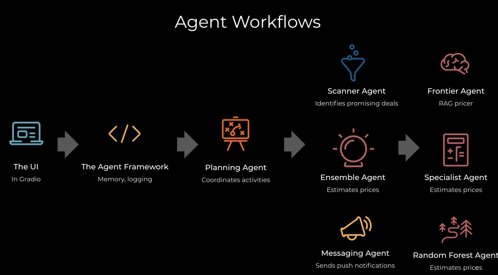

## Apply the 5 Step Strategy

For selecting, training and applying an LLM to a commercial problem.

1. **Understand**: getting deep into the business requirements and really understanding the problem you are solving, how do you judge success, what are the non-functional requirements, and makes sure it is all carefully documented.
2. **Prepare**: preparation is about testing baseline models and curating your dataset.
3. **Select**: selecting the model(s) you will be using for the rest of the project.
4. **Customize**: is where you use one of the main techniques like prompting, RAG or fine-tuning to get the best result out of the model(s)
5. **Productionize**

### How will we evaluate performance?

From our Predicted Prices verses Actual prices.

**Model-centric or Technical Metrics**:

- Training loss
- Validation loss
- [Root Mean Squared Log Error (RMSLE)](https://www.kaggle.com/code/carlolepelaars/understanding-the-metric-rmsle)

**Business-centric or Outcome Metrics**

- Average price difference: belongs in both types of metrics and is very simple and understandable by humans so a great business outcome metric. Flawed for comparing higher and lower price items like prediction \$50 off for $800 product is a good result but on a \$10 product a 50% error is quite significant
- % price difference: ok for high price items but not so good for low price items since a small price difference with be high %, e.g. \$10 predicted as \$12 is 20% out which is a bit harsh
- % estimate that are "good": create a criteria used to judge that estimate is good quality and criteria could combine an absolute diff and a % diff, e.g. either within \$40 or 20% then considered a good enough estimate, then measure what % of the model's predictions meet this criteria

Note: simpler test is [mean squared error (MSE)](https://en.wikipedia.org/wiki/Root_mean_square_deviation), which is the square of the difference between the prediction and the actual price. The challenge with MSE is that is blows up for larger prices, e.g. product costs \$800 and predict \$900 with diff of \$100 then square of 100 is 10,000 which is a big number and dwarf all other errors. So is not a good fit for this kind of problem.

### Data Curation

Resources:

- [The dataset](https://huggingface.co/datasets/McAuley-Lab/Amazon-Reviews-2023)
- [Folder with all the product datasets](https://huggingface.co/datasets/McAuley-Lab/Amazon-Reviews-2023/tree/main/raw/meta_categories)
- Use a variety of [colors in matplotlib charts](https://matplotlib.org/stable/gallery/color/named_colors.html)

See charts and graphs inline:

    %matplotlib inline

Custom classes:

- [Item](.\classes\items.py)
- [ItemLoader](.\classes\loaders.py)
- [Tester](.\classes\testing.py)

Dependencies:

    import os
    import random
    from dotenv import load_dotenv
    from huggingface_hub import login
    from datasets import load_dataset, Dataset, DatasetDict
    import matplotlib.pyplot as plt
    from collections import Counter, defaultdict
    import numpy as np
    import pickle
    from loaders import ItemLoader
    from items import Item

#### Part 1

Begin scrubbing and curating the dataset by focusing on a subset of the data: Home Appliances.

See [Data Curation Part 1](https://github.com/jstoops/product-pricing-agent/blob/main/data-curation/part1.ipynb) for details.

##### Investigate Chosen Dataset to Verify Suitability

Steps:

1. Load in our dataset:

```
dataset = load_dataset("McAuley-Lab/Amazon-Reviews-2023", f"raw_meta_Appliances", split="full", trust_remote_code=True)
print(f"Number of Appliances: {len(dataset):,}")
```

> Number of Appliances: 94,327

2. Investigate a particular datapoint:

```
datapoint = dataset[2]
print(datapoint["title"])
print(datapoint["description"])
print(datapoint["features"])
print(datapoint["details"])
print(datapoint["price"])
```

> Clothes Dryer Drum Slide, General Electric, Hotpoint, WE1M333, WE1M504
>
> ['Brand new dryer drum slide, replaces General Electric, Hotpoint, RCA, WE1M333, WE1M504.']
> []
> {"Manufacturer": "RPI", "Part Number": "WE1M333,", "Item Weight": "0.352 ounces", "Package Dimensions": "5.5 x 4.7 x 0.4 inches", "Item model number": "WE1M333,", "Is Discontinued By Manufacturer": "No", "Item Package Quantity": "1", "Batteries Included?": "No", "Batteries Required?": "No", "Best Sellers Rank": {"Tools & Home Improvement": 1315213, "Parts & Accessories": 181194}, "Date First Available": "February 25, 2014"}
>
> None

3. How many have prices? Are there enough for training, validation, and testing?

```
prices = 0
for datapoint in dataset:
    try:
        price = float(datapoint["price"])
        if price > 0:
            prices += 1
    except ValueError as e:
        pass

print(f"There are {prices:,} with prices which is {prices/len(dataset)\*100:,.1f}%")
```

> There are 46,726 with prices which is 49.5%

4. For those with prices, gather the price and the length:

```
prices = []
lengths = []
for datapoint in dataset:
    try:
        price = float(datapoint["price"])
        if price > 0:
            prices.append(price)
            contents = datapoint["title"] + str(datapoint["description"]) + str(datapoint["features"]) + str(datapoint["details"])
            lengths.append(len(contents))
    except ValueError as e:
        pass
```

5. Plot the distribution of lengths:

```
plt.figure(figsize=(15, 6))
plt.title(f"Lengths: Avg {sum(lengths)/len(lengths):,.0f} and highest {max(lengths):,}\n")
plt.xlabel('Length (chars)')
plt.ylabel('Count')
plt.hist(lengths, rwidth=0.7, color="lightblue", bins=range(0, 6000, 100))
plt.show()
```

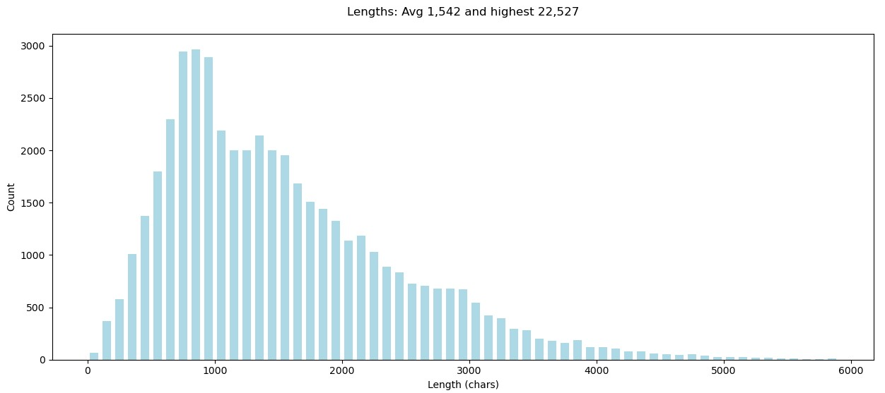

6. Plot the distribution of prices:

```
plt.figure(figsize=(15, 6))
plt.title(f"Prices: Avg {sum(prices)/len(prices):,.2f} and highest {max(prices):,}\n")
plt.xlabel('Price ($)')
plt.ylabel('Count')
plt.hist(prices, rwidth=0.7, color="orange", bins=range(0, 1000, 10))
plt.show()
```
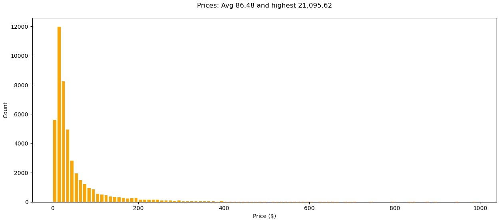

7. Identify highly priced outliers:

```
for datapoint in dataset:
    try:
        price = float(datapoint["price"])
        if price > 21000:
            print(datapoint['title'])
            print(datapoint["price"])
    except ValueError as e:
        pass
```

> TurboChef BULLET Rapid Cook Electric Microwave Convection Oven
>
> 21095.62

##### Curate Dataset

Chosen approach:

- Select items that cost between 1 and 999 USD
- Create item instances, which truncate the text to fit within 180 tokens using the right Tokenizer
- Create a prompt to be used during Training.
- Reject items if they don't have sufficient characters.

_Why are we truncating to 180 tokens? How did we determine that number?_

**The answer**: this is an example of a "hyper-parameter". In other words, it's basically trial and error! We want a sufficiently large number of tokens so that we have enough useful information to gauge the price. But we also want to keep the number low so that we can train efficiently.

Start with a number that seemed reasonable, and experiment with a few variations before settling on the right number of tokens. This kind of trial-and-error might sound a bit unsatisfactory, but it's a crucial part of the data science R&D process.

There's another interesting reason why we might favor a lower number of tokens in the training data. When we eventually get to use our model at inference time, we'll want to provide new products and have it estimate a price. And we'll be using short descriptions of products - like 1-2 sentences. For best performance, we should size our training data to be similar to the inputs we will provide at inference time.

_But I see in [items.py](https://github.com/jstoops/product-pricing-agent/blob/main/testing/items.py) it constrains inputs to 160 tokens?_

**The answer**: The description of the products is limited to 160 tokens because we add some more text before and after the description to turn it into a prompt. That brings it to around 180 tokens in total.

Steps:

1. Create an Item object for each with a price:

```
items = []
for datapoint in dataset:
    try:
        price = float(datapoint["price"])
        if price > 0:
            item = Item(datapoint, price)
            if item.include:
                items.append(item)
    except ValueError as e:
        pass

print(f"There are {len(items):,} items")
```

> There are 29,191 items

2. Look at the first item:

`items[1]`

> <WP67003405 67003405 Door Pivot Block - Compatible Kenmore KitchenAid Maytag Whirlpool Refrigerator - Replaces AP6010352 8208254 PS11743531 - Quick DIY Repair Solution = $16.52>

3. Investigate the prompt that will be used during training - the model learns to complete this:

`print(items[100].prompt)`

> How much does this cost to the nearest dollar?
>
> Samsung Assembly Ice Maker-Mech
>
> This is an O.E.M. Authorized part, fits with various Samsung brand models, oem part # this product in manufactured in south Korea. This is an O.E.M. Authorized part Fits with various Samsung brand models Oem part # This is a Samsung replacement part Part Number This is an O.E.M. part Manufacturer J&J International Inc., Part Weight 1 pounds, Dimensions 18 x 12 x 6 inches, model number Is Discontinued No, Color White, Material Acrylonitrile Butadiene Styrene, Quantity 1, Certification Certified frustration-free, Included Components Refrigerator-replacement-parts, Rank Tools & Home Improvement Parts & Accessories 31211, Available April 21, 2011
>
> Price is $118.00

4. Investigate the prompt that will be used during testing - the model has to complete this:

`print(items[100].test_prompt())`

> How much does this cost to the nearest dollar?
>
> Samsung Assembly Ice Maker-Mech
>
> This is an O.E.M. Authorized part, fits with various Samsung brand models, oem part # this product in manufactured in south Korea. This is an O.E.M. Authorized part Fits with various Samsung brand models Oem part # This is a Samsung replacement part Part Number This is an O.E.M. part Manufacturer J&J International Inc., Part Weight 1 pounds, Dimensions 18 x 12 x 6 inches, model number Is Discontinued No, Color White, Material Acrylonitrile Butadiene Styrene, Quantity 1, Certification Certified frustration-free, Included Components Refrigerator-replacement-parts, Rank Tools & Home Improvement Parts & Accessories 31211, Available April 21, 2011
>
> Price is $

5. Plot the distribution of token counts:

```
tokens = [item.token_count for item in items]
plt.figure(figsize=(15, 6))
plt.title(f"Token counts: Avg {sum(tokens)/len(tokens):,.1f} and highest {max(tokens):,}\n")
plt.xlabel('Length (tokens)')
plt.ylabel('Count')
plt.hist(tokens, rwidth=0.7, color="green", bins=range(0, 300, 10))
plt.show()
```

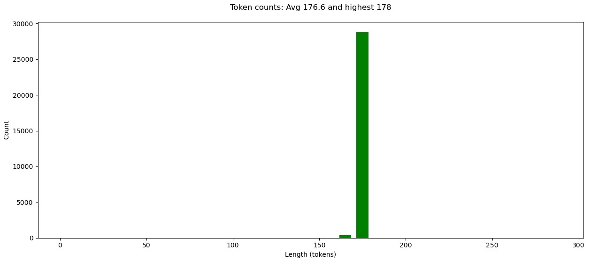

6. Plot the distribution of prices:

```
prices = [item.price for item in items]
plt.figure(figsize=(15, 6))
plt.title(f"Prices: Avg {sum(prices)/len(prices):,.1f} and highest {max(prices):,}\n")
plt.xlabel('Price ($)')
plt.ylabel('Count')
plt.hist(prices, rwidth=0.7, color="purple", bins=range(0, 300, 10))
plt.show()
```

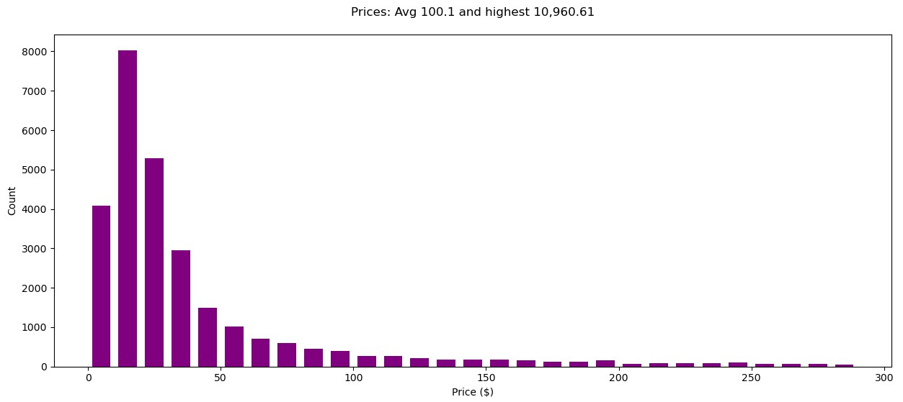

#### Part 2

**Objective**: Craft a dataset which is more balanced in terms of prices. Less heavily scewed to cheap items, with an average that's higher than \\$60. Balance out the categories, i.e. fewer Automotive items.

Combine the Appliances dataset investigated with many other types of product like Electronics and Automotive. This will give us a massive dataset, and we can then be picky about choosing a subset that will be most suitable for training.

Extend our dataset to a greater coverage, and craft it into an excellent dataset for training.

Data curation can seem less exciting than other things we work on, but it's a crucial part of the LLM engineers' responsibility and an important craft to hone, so that you can build your own commercial solutions with high quality datasets.

See [Data Curation Part 2](https://github.com/jstoops/product-pricing-agent/blob/main/data-curation/part2.ipynb) for details.

##### Load Datasets

1. Load in the same dataset as last time

`items = ItemLoader("Appliances").load()`

> Completed Appliances with 28,625 datapoints in 0.3 mins

2. Look for a familiar item..

`print(items[1].prompt)`

> How much does this cost to the nearest dollar?
>
> Door Pivot Block - Compatible Kenmore KitchenAid Maytag Whirlpool Refrigerator - Replaces - Quick DIY Repair Solution
>
> Pivot Block For Vernicle Mullion Strip On Door - A high-quality exact equivalent for part numbers and Compatibility with major brands - Door Guide is compatible with Whirlpool, Amana, Dacor, Gaggenau, Hardwick, Jenn-Air, Kenmore, KitchenAid, and Maytag. Quick DIY repair - Refrigerator Door Guide Pivot Block Replacement will help if your appliance door doesn't open or close. Wear work gloves to protect your hands during the repair process. Attentive support - If you are uncertain about whether the block fits your refrigerator, we will help. We generally put forth a valiant effort to guarantee you are totally
>
> Price is $17.00

3. Scale up by looking at all datasets of all the items that you might find in a large home retail store - electrical, electronic, office and related, but not clothes / beauty / books:

```
dataset_names = [
    "Automotive",
    "Electronics",
    "Office_Products",
    "Tools_and_Home_Improvement",
    "Cell_Phones_and_Accessories",
    "Toys_and_Games",
    "Appliances",
    "Musical_Instruments",
]

items = []
for dataset_name in dataset_names:
    loader = ItemLoader(dataset_name)
    items.extend(loader.load())
```

> Loading dataset Automotive
> Completed Automotive with 911,688 datapoints in 11.3 mins
>
> Loading dataset Electronics
> Completed Electronics with 443,473 datapoints in 9.5 mins
>
> Loading dataset Office_Products
> Completed Office_Products with 240,394 datapoints in 3.6 mins
>
> Loading dataset Tools_and_Home_Improvement
> Completed Tools_and_Home_Improvement with 541,051 datapoints in 8.5 mins
>
> Loading dataset Cell_Phones_and_Accessories
> Completed Cell_Phones_and_Accessories with 238,869 datapoints in 7.1 mins
>
> Loading dataset Toys_and_Games
> Completed Toys_and_Games with 340,479 datapoints in 4.6 mins
>
> Loading dataset Appliances
> Completed Appliances with 28,625 datapoints in 0.3 mins
>
> Loading dataset Musical_Instruments
> Completed Musical_Instruments with 66,829 datapoints in 1.1 mins

`print(f"A grand total of {len(items):,} items")`

> A grand total of 2,811,408 items

4. Plot the distribution of token counts again

5. Plot the distribution of prices:

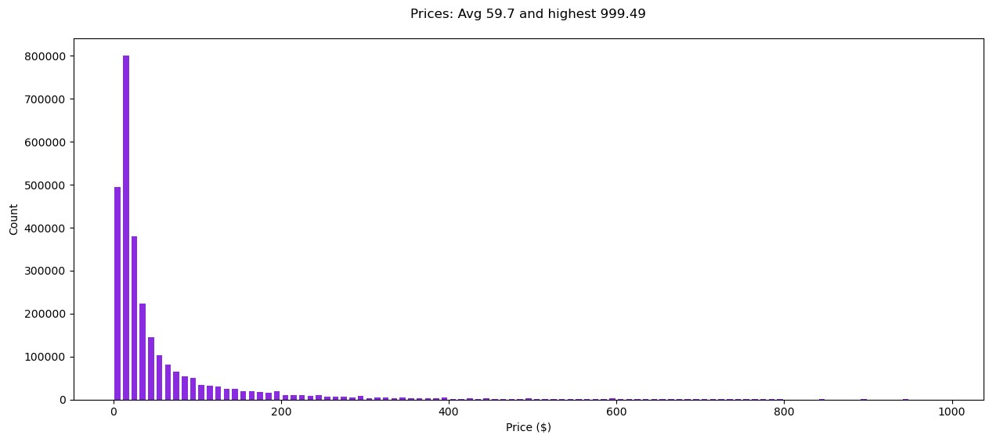

6. Count number of items in each product type category:

```
category_counts = Counter()
for item in items:
    category_counts[item.category]+=1

categories = category_counts.keys()
counts = [category_counts[category] for category in categories]
```

7. Plot number of items in each category:

```
\# Bar chart by category
plt.figure(figsize=(15, 6))
plt.bar(categories, counts, color="goldenrod")
plt.title('How many in each category')
plt.xlabel('Categories')
plt.ylabel('Count')

plt.xticks(rotation=30, ha='right')

\# Add value labels on top of each bar
for i, v in enumerate(counts):
    plt.text(i, v, f"{v:,}", ha='center', va='bottom')

\# Display the chart
plt.show()
```

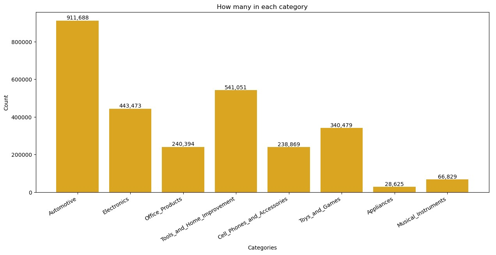

##### Balance Dataset

**Objective**: Craft a dataset which is more balanced in terms of prices. Less heavily scewed to cheap items, with an average that's higher than //$60. Balance out the categories, i.e. fewer Automotive items.

1. Create a dict with a key of each price from $1 to $999 and in the value, put a list of items with that price (to nearest round number):

```
slots = defaultdict(list)
for item in items:
    slots[round(item.price)].append(item)
```

2. Create a dataset called "sample" which tries to more evenly take from the range of prices and gives more weight to items from categories other than Automotive:

```
/# Set random seed for reproducibility
np.random.seed(42)
random.seed(42)

sample = []
for i in range(1, 1000):
    slot = slots[i]
    if i>=240:
        sample.extend(slot)
    elif len(slot) <= 1200:
        sample.extend(slot)
    else:
        weights = np.array([1 if item.category=='Automotive' else 5 for item in slot])
        weights = weights / np.sum(weights)
        selected_indices = np.random.choice(len(slot), size=1200, replace=False, p=weights)
        selected = [slot[i] for i in selected_indices]
        sample.extend(selected)

print(f"There are {len(sample):,} items in the sample")
```

> There are 408,635 items in the sample

3. Plot the distribution of prices in sample:

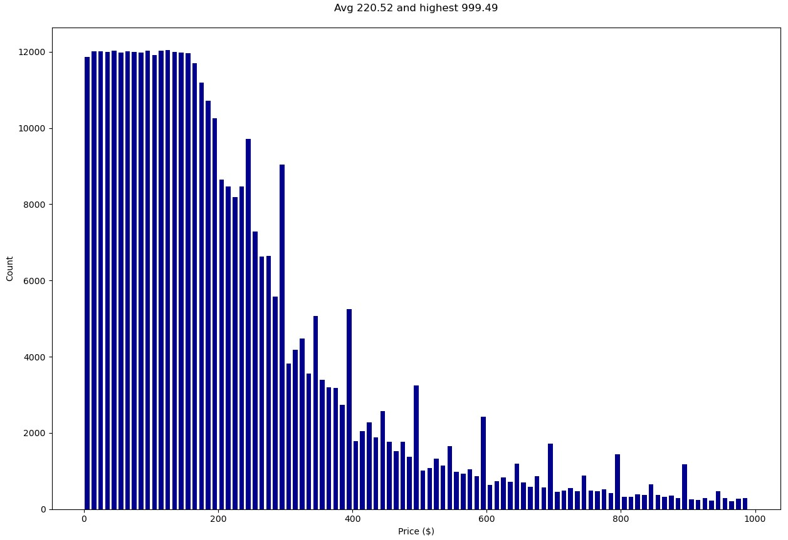
OK, we did well in terms of raising the average price and having a smooth-ish population of prices

4. Plot number of items in each category:

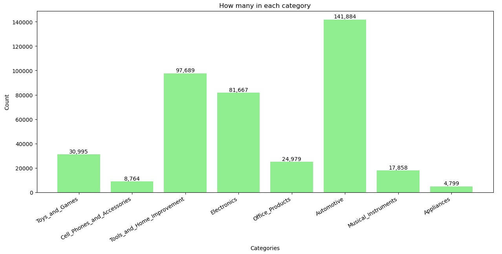
Automotive still in the lead, but improved somewhat

5. For another perspective, look at number of items in each category in a pie chart:

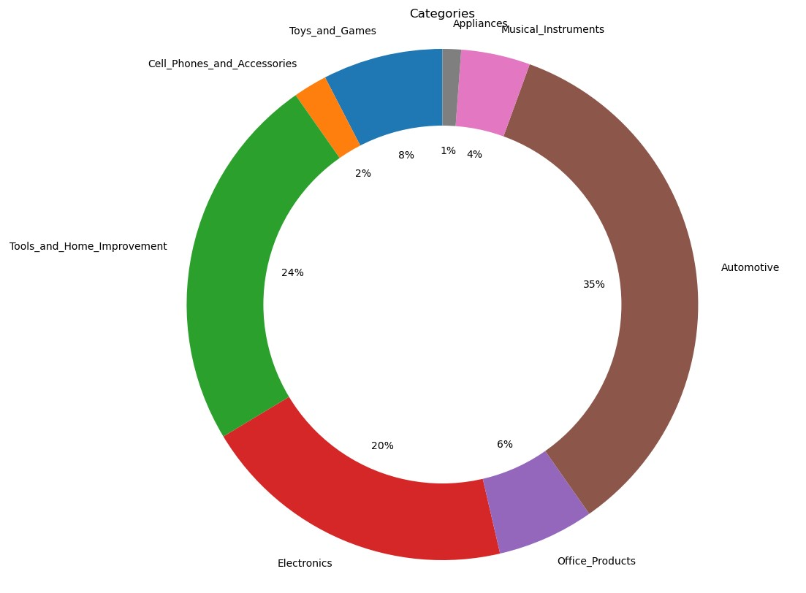

6. How does the price vary with the character count of the prompt?

```
sizes = [len(item.prompt) for item in sample]
prices = [item.price for item in sample]

\# Create the scatter plot
plt.figure(figsize=(15, 8))
plt.scatter(sizes, prices, s=0.2, color="red")

\# Add labels and title
plt.xlabel('Size')
plt.ylabel('Price')
plt.title('Is there a simple correlation?')

\# Display the plot
plt.show()
```

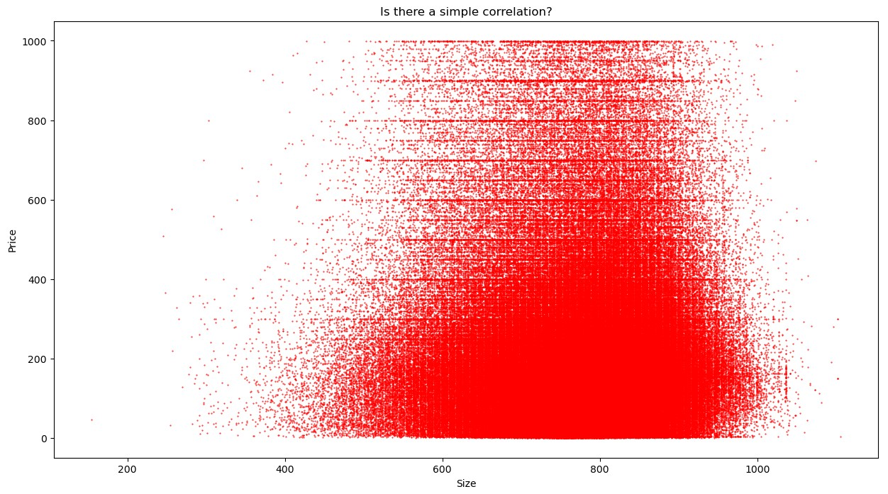

7. Check token count for price in prompt:

```
def report(item):
    prompt = item.prompt
    tokens = Item.tokenizer.encode(item.prompt)
    print(prompt)
    print(tokens[-10:])
    print(Item.tokenizer.batch_decode(tokens[-10:]))

report(sample[398000])
```

> How much does this cost to the nearest dollar?
>
> MonoRS Coilovers Lowering Kit Made For Scion FRS Fully Adjustable, Set of 4
> MonoRS Coilover damper kit by Godspeed Project are intermediate suspension upgrade setup for daily and Sunday club racing. Lowering your car with improved springs over factory and paired with Mono-tubo shocks with valving that allows 32 levels of rebound adjustment to improve handling without sacrifice comfort. Ride height can easily be adjusted by twisting the lower mount bracket. In order to keep weight gain at the minimum, most of attachments and accessories are CNC machined from billet aluminum. Koyo bearings are used when camber plate top mount is applicable depends on car models. To assure that our customers are getting high quality products, MonoRS coilovers are covered by 12 months limited warranty by the manufacturer from
>
> Price is $765.00<br>
> `[279, 14290, 505, 271, 7117, 374, 400, 22240, 13, 410]` > `[' the', ' manufacturer', ' from', '\n\n', 'Price', ' is', ' $', '765', '.', '00']`

**Observation**: An interesting thing about the Llama tokenizer is that every number from 1 to 999 gets mapped to 1 token, much as we saw with gpt-4o. The same is not true of qwen2, gemma and phi3, which all map individual digits to tokens. This does turn out to be a bit useful for our project, although it's not an essential requirement.

##### Create Training, Test and Validation Datasets

Break down our data into a training, test and validation dataset.

It's typical to use 5%-10% of your data for testing purposes, but actually we have far more than we need at this point. We'll take 400,000 points for training, and we'll reserve 2,000 for testing, although we won't use all of them.

1. Split sample into training and test datasets:

```
random.seed(42)
random.shuffle(sample)
train = sample[:400_000]
test = sample[400_000:402_000]
print(f"Divided into a training set of {len(train):,} items and test set of {len(test):,} items")
```

> Divided into a training set of 400,000 items and test set of 2,000 items

2. Validate training prompt:

`print(train[0].prompt)`

> How much does this cost to the nearest dollar?
>
> Delphi FG0166 Fuel Pump Module
> Delphi brings 80 years of OE Heritage into each Delphi pump, ensuring quality and fitment for each Delphi part. Part is validated, tested and matched to the right vehicle application Delphi brings 80 years of OE Heritage into each Delphi assembly, ensuring quality and fitment for each Delphi part Always be sure to check and clean fuel tank to avoid unnecessary returns Rigorous OE-testing ensures the pump can withstand extreme temperatures Brand Delphi, Fit Type Vehicle Specific Fit, Dimensions LxWxH 19.7 x 7.7 x 5.1 inches, Weight 2.2 Pounds, Auto Part Position Unknown, Operation Mode Mechanical, Manufacturer Delphi, Model FUEL PUMP, Dimensions 19.7
>
> Price is $227.00

3. Validate test prompt:

`print(test[0].test_prompt())`

> How much does this cost to the nearest dollar?
>
> OEM AC Compressor w/A/C Repair Kit For Ford F150 F-150 V8 & Lincoln Mark LT 2007 2008 - BuyAutoParts NEW
> As one of the world's largest automotive parts suppliers, our parts are trusted every day by mechanics and vehicle owners worldwide. This A/C Compressor and Components Kit is manufactured and tested to the strictest OE standards for unparalleled performance. Built for trouble-free ownership and 100% visually inspected and quality tested, this A/C Compressor and Components Kit is backed by our 100% satisfaction guarantee. Guaranteed Exact Fit for easy installation 100% BRAND NEW, premium ISO/TS 16949 quality - tested to meet or exceed OEM specifications Engineered for superior durability, backed by industry-leading unlimited-mileage warranty Included in this K
>
> Price is $

4. Plot the distribution of prices in the first 250 test points

```
prices = [float(item.price) for item in test[:250]]
plt.figure(figsize=(15, 6))
plt.title(f"Avg {sum(prices)/len(prices):.2f} and highest {max(prices):,.2f}\n")
plt.xlabel('Price ($)')
plt.ylabel('Count')
plt.hist(prices, rwidth=0.7, color="darkblue", bins=range(0, 1000, 10))
plt.show()
```

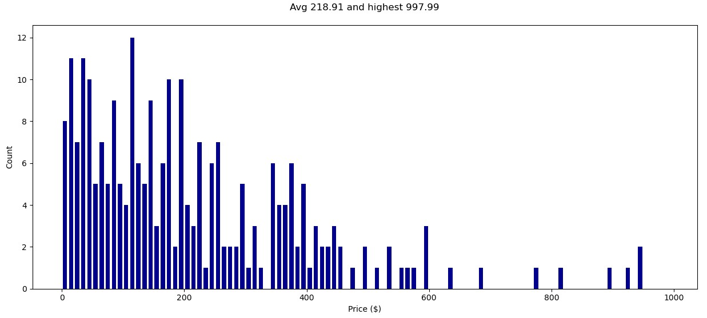

##### Upload Dataset to HuggingFace Hub

1. Convert to prompts:

```
train_prompts = [item.prompt for item in train]
train_prices = [item.price for item in train]
test_prompts = [item.test_prompt() for item in test]
test_prices = [item.price for item in test]
```

2. Create a Dataset from the lists:

```
train_dataset = Dataset.from_dict({"text": train_prompts, "price": train_prices})
test_dataset = Dataset.from_dict({"text": test_prompts, "price": test_prices})
dataset = DatasetDict({
  "train": train_dataset,
  "test": test_dataset
})
```

3. Upload to HuggingFace hub:

```
HF_USER = "my-HF-username"
DATASET_NAME = f"{HF_USER}/pricer-data"
dataset.push_to_hub(DATASET_NAME, private=True)
```

##### Save Data Locally

Pickle the training and test dataset so we don't have to execute all this code next time:

```
with open('train.pkl', 'wb') as file:
    pickle.dump(train, file)

with open('test.pkl', 'wb') as file:
    pickle.dump(test, file)
```

### Building ML Baselines for NLP

[Natural Language Processing (NLP)](https://en.wikipedia.org/wiki/Natural_language_processing) is primarily concerned with providing computers with the ability to process data encoded in natural language.

[Root Mean Squared Logarithmic Error (RMSLE)](https://www.kaggle.com/code/carlolepelaars/understanding-the-metric-rmsle)

Average Absolute Prediction Error Baseline Models:
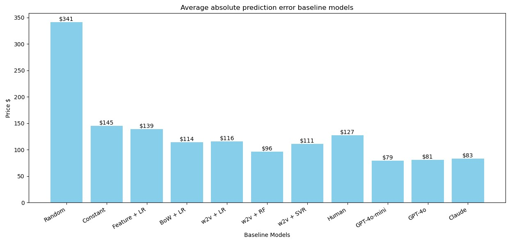

#### Guessing the Price Baselines

**Random number**

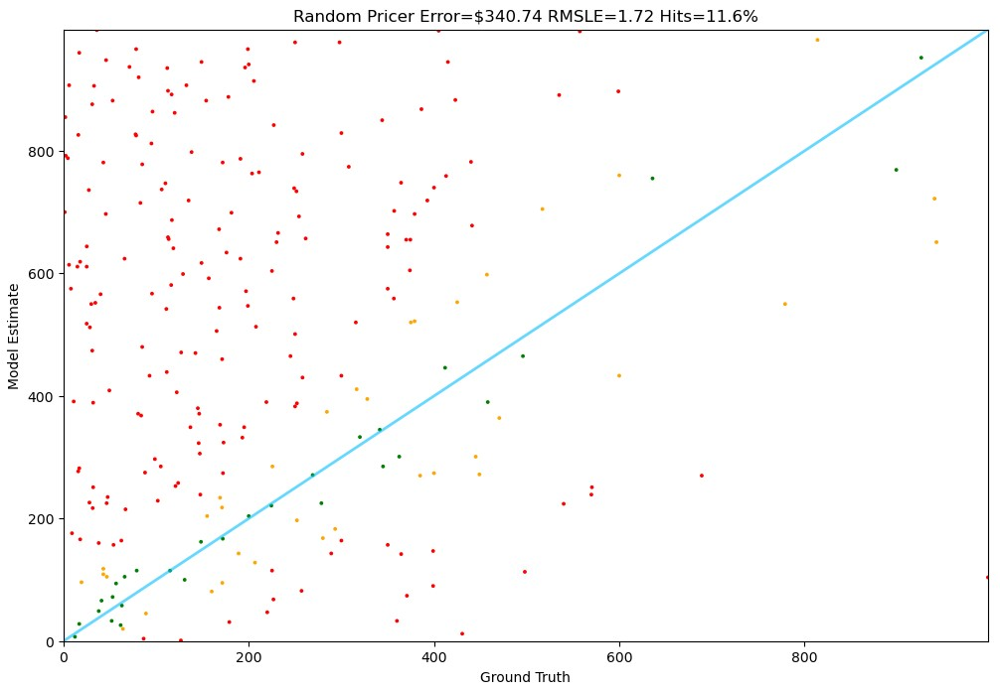

**Result**: As expected it's completely random.

- Random Pricer Error=$340.74
- RMSLE=1.72
- Hits=11.6%

**Average price in dataset**

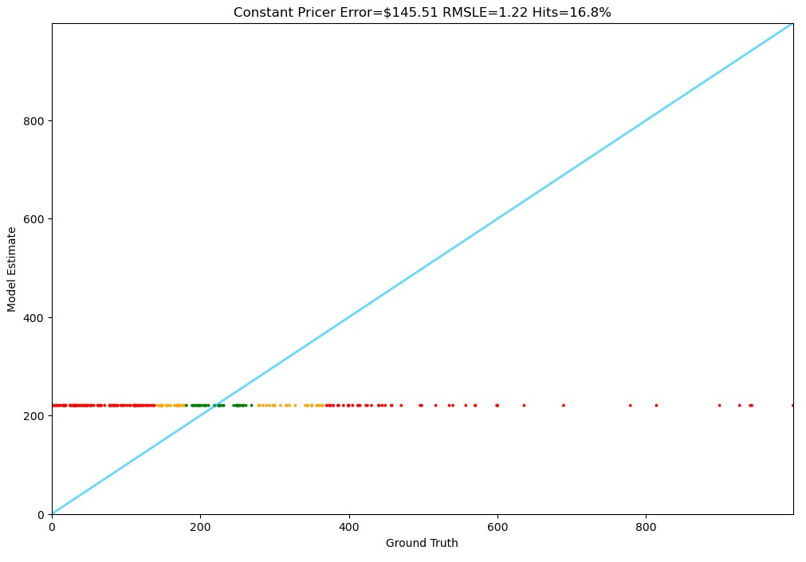

**Result**: As expected it's only close if the price is close to the average price but better than a completely random guess.

- Constant Pricer Error=$145.51
- RMSLE=1.22
- Hits=16.8%

#### Traditional ML Models

Dependencies:

    import os
    import math
    import json
    import random
    from dotenv import load_dotenv
    from huggingface_hub import login
    import matplotlib.pyplot as plt
    import numpy as np
    import pickle
    from collections import Counter
    from items import Item
    from testing import Tester

    \# More imports for our traditional machine learning
    import pandas as pd
    import numpy as np
    from sklearn.linear_model import LinearRegression
    from sklearn.metrics import mean_squared_error, r2_score
    from sklearn.preprocessing import StandardScaler

    \# NLP related imports
    from sklearn.feature_extraction.text import CountVectorizer
    from gensim.models import Word2Vec
    from gensim.utils import simple_preprocess

    \#imports for more advanced machine learning
    from sklearn.svm import LinearSVR
    from sklearn.ensemble import RandomForestRegressor

Quickly set up these solutions to give us a starting point:

- [Feature engineering](https://en.wikipedia.org/wiki/Feature_engineering) & [Linear Regression](https://en.wikipedia.org/wiki/Linear_regression)
- [Bag of Words (BoW)](https://en.wikipedia.org/wiki/Bag-of-words_model) & Linear Regression
- [Word2vec](https://en.wikipedia.org/wiki/Word2vec) & Linear Regression
- Word2vec & [Random Forest](https://en.wikipedia.org/wiki/Random_forest)
- Word2vec & [SVR](https://www.geeksforgeeks.org/support-vector-regression-svr-using-linear-and-non-linear-kernels-in-scikit-learn/)

See [Traditional ML Baseline Models](https://github.com/jstoops/product-pricing-agent/blob/main/baseline-models/traditional-ml.ipynb) for details.

##### Feature engineering & Linear Regression

When we understand the data and say what do we think are going to be important factors that are likely to affect the price. Come up with these "features" like how they rank in Amazon's best seller rank and then see if some linear combination of these features does a good job of predicting the price or not.

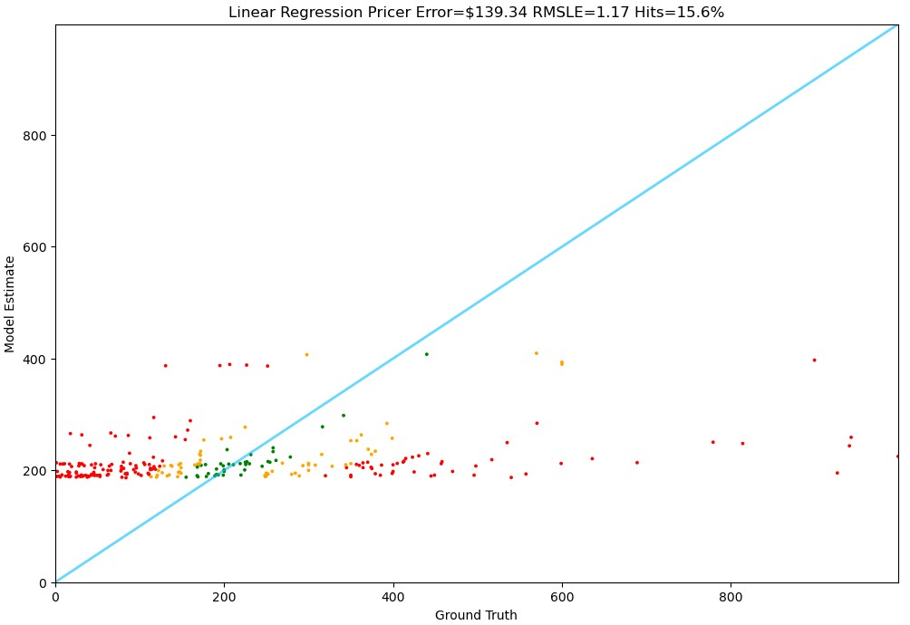

**Result**: Did not do much better than using a random number or the average price.

- Feature Engineering LR Pricer Error=$139.34
- RMSLE=1.17
- Hits=15.6%

##### Bag of Word & Linear Regression

[Bag of Words (BoW)](https://en.wikipedia.org/wiki/Bag-of-words_model) is a simplistic NLP approach where you count up the number of words and build yourself a little vector that consists of how many times each word features in the product description. You don't include "stop" words like "the".

For example, the word "Intel" could be a word in our vocab indicating that the product is a laptop or computer of a certain value and depending on if it exists and how many times it appears that will affect that location in this bag of words. Then take this list of counts of words and see if there is some linear combination of these different words that when combined together predicts the price of a product.

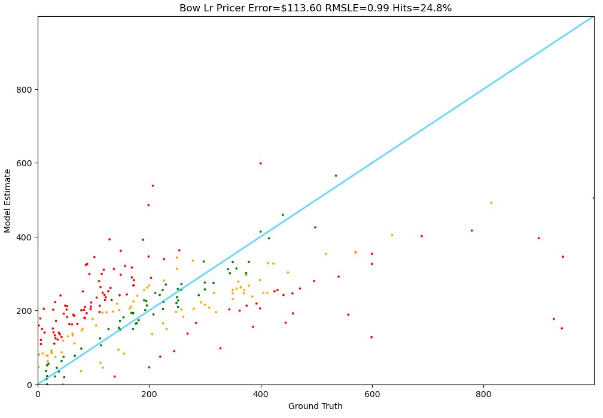

**Result**: Did much better than feature engineering and guessing.

- BoW LR Pricer Error=$113.60
- RMSLE=0.99
- Hits=24.8%

##### Word2vec & Linear Regression

[Word2vec](https://en.wikipedia.org/wiki/Word2vec) is a neural network encoding algorithm that can produce a vector in a way that is smarter than a Bag of Words.

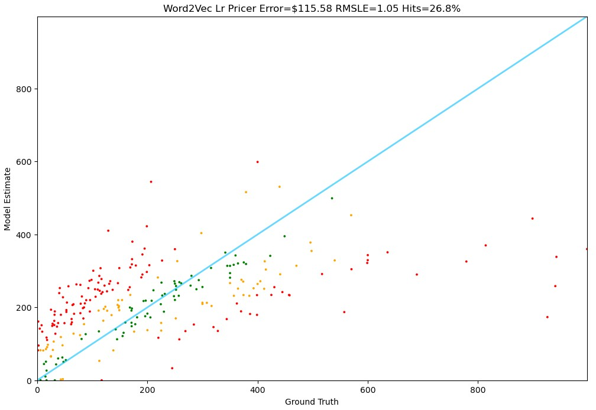

**Result**: Did much better than feature engineering and guessing but not quite as good as Bag of Word and Linear Regression.

- Word2vec LR Pricer Error=$115.58
- RMSLE=1.05
- Hits=26.8%

##### Word2vec & Random Forest

[Random Forest](https://en.wikipedia.org/wiki/Random_forest) is a more sophisticated technique that involves taking random chunks of your data and your features in the form of bits of our vectors and creatign a series of models that combines averages across many of these little samples.

Generally known to perform well for all shapes and sizes of datasets. They are good because they don't have a lot of hyperparameters - extra knobs to tweak, things you have to try lots of values for. Just use as is and see how it does.

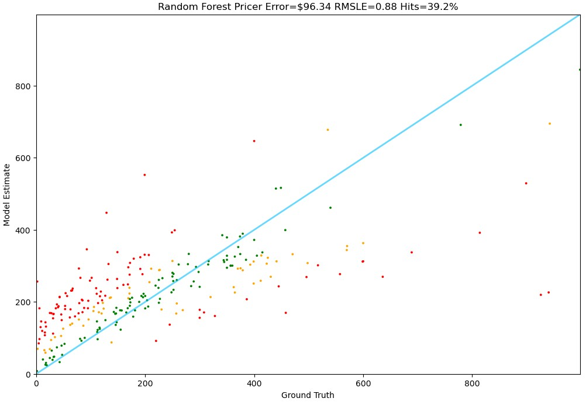

**Result**: Does the best out of all the traditional ML models but has some issues predicitng when above the average price. This is a good baseline.

- Word2vec Random Forest Pricer Error=$96.34
- RMSLE=0.88
- Hits=39.2%

##### Word2vec & SVR

[Support Vector Regression (SVR)](https://www.geeksforgeeks.org/support-vector-regression-svr-using-linear-and-non-linear-kernels-in-scikit-learn/) is a type of [support vector machines](https://en.wikipedia.org/wiki/Support_vector_machine). This is another technique for separating out data into different groups.

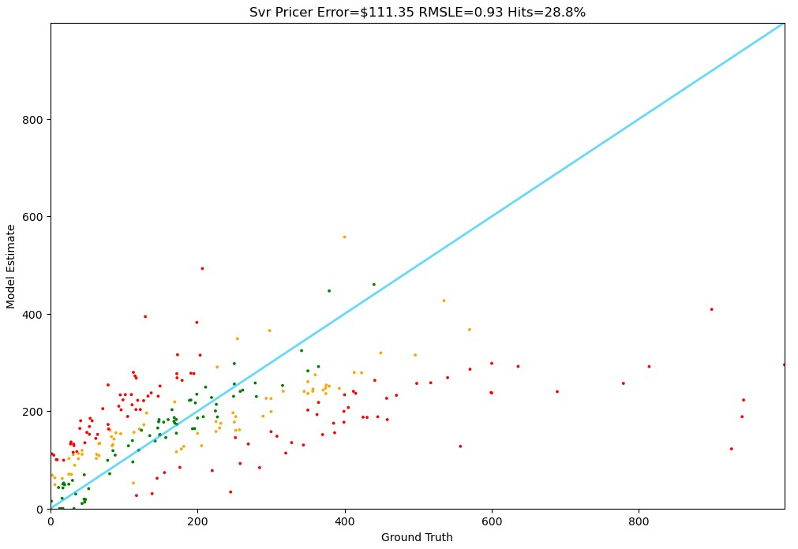

**Result**: Did slightly better than Bag of Word / word2vec and Linear Regression but not as good as Randon Forest.

- Word2vec SVR Regression Pricer Error=$111.35
- RMSLE=0.93
- Hits=28.8%

### Human Baselines

Have a human read the 250 product descriptions and guessing the cost.

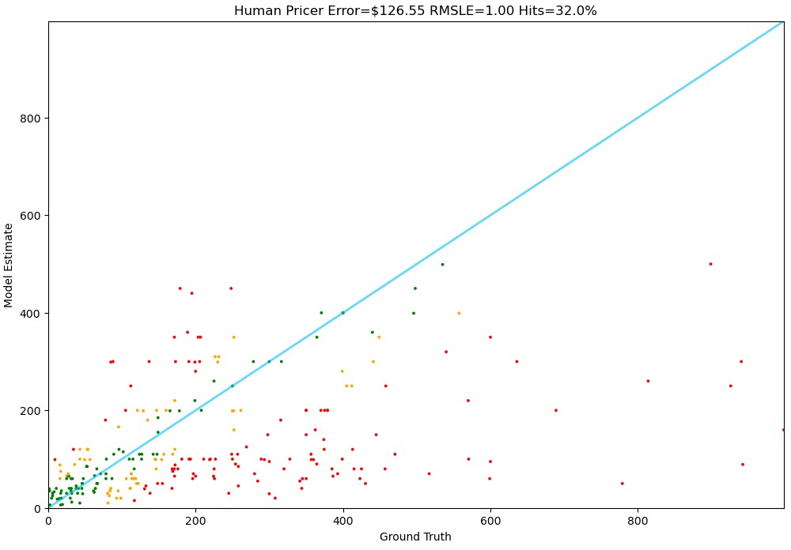

**Result**: Did better than word2vec and Linear Regression but not quite as good as Bag of Word and Linear Regression.

- Human Pricer Error=$126.55
- RMSLE=1.00
- Hits=32.0%

See Frontier Models vs Human Baseline Model [Setup](https://github.com/jstoops/product-pricing-agent/blob/main/baseline-models/frontier-vs-human-setup.ipynb) and [Test Results](https://github.com/jstoops/product-pricing-agent/blob/main/baseline-models/frontier-vs-human-test-results.ipynb) for details.

### Frontier Model Baselines

**Important note**: we aren't _Training_ the frontier models. We're only providing them with the Test dataset to see how they perform. They don't gain the benefit of the 400,000 training examples that we provided to the Traditional ML models.

See [Frontier Models vs Human Baseline Model](https://github.com/jstoops/product-pricing-agent/blob/main/baseline-models/frontier-vs-human.ipynb) for details.

It's entirely possible that in their monstrously large training data, they've already been exposed to all the products in the training AND the test set. So there could be test "contamination" here which gives them an unfair advantage. We should keep that in mind.

_Why not OpenAI o1?_ This is not the kind of problem it is designed for. The o1 model is designed for problems where deeper thinking is required and multi step thought processes. It will also be slower and more expensive. We are not trying to solve math puzzles just trying to get the most likely price based on wordly knowledge.

Create system prompt to ensure the LLM knows it needs to estimate the price of a product and reply with just the price and no explantation.

In the user prompt strip out the " to the nearest dollar" text since Frontier models are much more capable and powerful than traditional ML models and remove the "Price is $" text so that is can be used in the assistant prompt instead.

Example prompt:

> [{'role': 'system',
> 'content': 'You estimate prices of items. Reply only with the price, no explanation'},
> {'role': 'user',
> 'content': "How much does this cost?\n\nOEM AC Compressor w/A/C Repair Kit For Ford F150 F-150 V8 & Lincoln Mark LT 2007 2008 - BuyAutoParts NEW\nAs one of the world's largest automotive parts suppliers, our parts are trusted every day by mechanics and vehicle owners worldwide. This A/C Compressor and Components Kit is manufactured and tested to the strictest OE standards for unparalleled performance. Built for trouble-free ownership and 100% visually inspected and quality tested, this A/C Compressor and Components Kit is backed by our 100% satisfaction guarantee. Guaranteed Exact Fit for easy installation 100% BRAND NEW, premium ISO/TS 16949 quality - tested to meet or exceed OEM specifications Engineered for superior durability, backed by industry-leading unlimited-mileage warranty Included in this K"},
> {'role': 'assistant', 'content': 'Price is $'}]

##### GPT-4o-mini

Use seed to tell GPT that this should be reproducable and keep the tokens small since the system, user and assistant prompt is well crafted (and keeps the costs down).

    def gpt_4o_mini(item):
        response = openai.chat.completions.create(
            model="gpt-4o-mini",
            messages=messages_for(item),
            seed=42,
            max_tokens=5
        )
        reply = response.choices[0].message.content
        return get_price(reply)

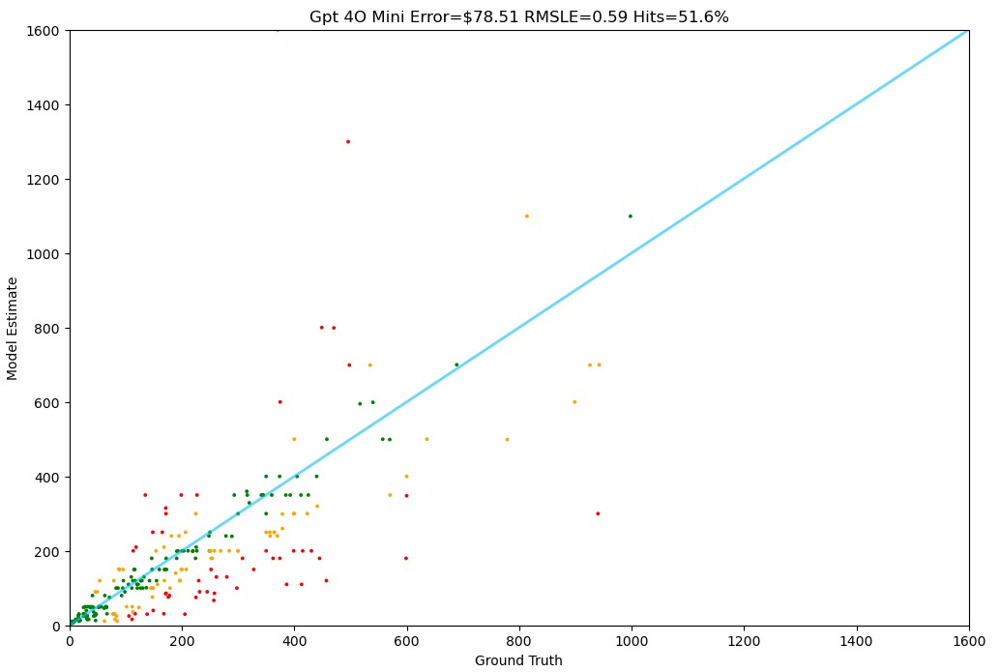

**Result**: Does much better than all the ML models even without training data.

- GPT 4o Mini Pricer Error=$78.51
- RMSLE=0.59
- Hits=51.6%

Note: still lots of errors and very few exact guesses so safe from test "contamination" here.

##### GPT 4o

Use seed to tell GPT that this should be reproducable and keep the tokens small since the system, user and assistant prompt is well crafted (and keeps the costs down).

    def gpt_4o_frontier(item):
        response = openai.chat.completions.create(
            model="gpt-4o-2024-08-06",
            messages=messages_for(item),
            seed=42,
            max_tokens=5
        )
        reply = response.choices[0].message.content
        return get_price(reply)

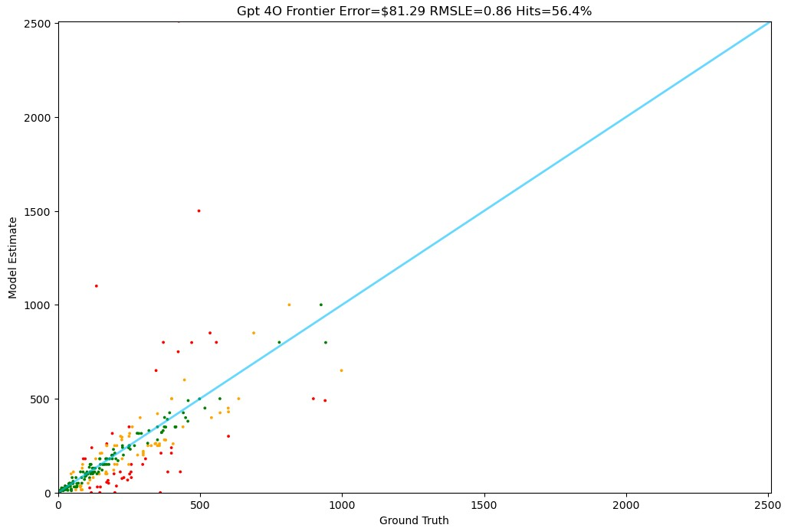

**Result**: Does much better than all the ML models but not as good as GPT 4o mini, which is surprising.

- GPT 4o Pricer Error=$81.29
- RMSLE=0.86
- Hits=56.64%

Note: still lots of errors and very few exact guesses so safe from test "contamination" here.

##### Claude 3.5 Sonnet

Keep the tokens small since the system, user and assistant prompt is well crafted (and keeps the costs down).

    def claude_3_point_5_sonnet(item):
        messages = messages_for(item)
        system_message = messages[0]['content']
        messages = messages[1:]
        response = claude.messages.create(
            model="claude-3-5-sonnet-20240620",
            max_tokens=5,
            system=system_message,
            messages=messages
        )
        reply = response.content[0].text
        return get_price(reply)

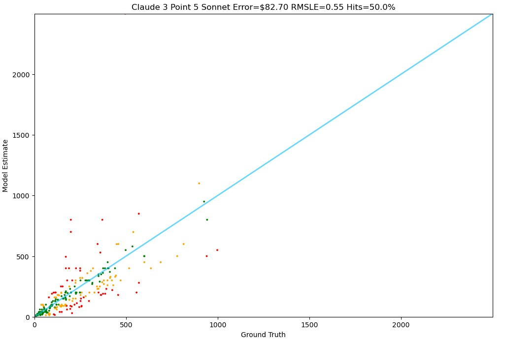

**Result**: Does much betrer than all the ML models but not as good as GPT.

- Claude 3.5 Sonnet Pricer Error=$82.70
- RMSLE=0.55
- Hits=50.0%

Note: still lots of errors and very few exact guesses so safe from test "contamination" here.

### Fine-Tuning Frontier Models

3 states to fine-tuning with OpenAI:

1. Create training dataset in jsonl format and upload to OpenAI
2. Run training - training loss and validation loss should decrease
3. Evaluate results, tweak and repeat

See GPT 4o Mini [Fine-Tuning](https://github.com/jstoops/product-pricing-agent/blob/main/training/gpt-fine-tuning.ipynb) and [Evaluation](https://github.com/jstoops/product-pricing-agent/blob/main/training/gpt-fine-tuning-evaluation.ipynb) for details.

#### Step 1: Preparing the Data

Prepare our data for fine-tuning in JSONL (JSON Lines) format and upload to OpenAI.

OpenAI expects data in JSONL format: rows of JSON each containing messages in the usual prompt format.

    {"messages" : [{"role": "system", "content": "You estimate prices..."}]}
    {"messages" : [{"role": "system", "content": "You estimate prices..."}]}
    {"messages" : [{"role": "system", "content": "You estimate prices..."}]}

Load in the pickle files - you can avoid curating all our data again if saved as pickle files:

with open('train.pkl', 'rb') as file:
train = pickle.load(file)

with open('test.pkl', 'rb') as file:
test = pickle.load(file)

Set training population from data - OpenAI recommends fine-tuning with populations of 50-100 examples.

In this training dataset we have over 4K and our examples are very small so we can go with 200 examples (and 1 epoch)

fine_tune_train = train[:200]
fine_tune_validation = train[200:250]

##### Prepare our data for fine-tuning in JSONL (JSON Lines) format and upload to OpenAI

1. Create a good prompt for a Frontier model - when we train our own models, we'll need to make the problem as easy as possible, but a Frontier model needs no such simplification.

```
def messages_for(item):
    system_message = "You estimate prices of items. Reply only with the price, no explanation"
    user_prompt = item.test_prompt().replace(" to the nearest dollar","").replace\"\n\nPrice is $","")
    return [
        {"role": "system", "content": system_message},
        {"role": "user", "content": user_prompt},
        {"role": "assistant", "content": f"Price is ${item.price:.2f}"}
    ]

messages_for(train[0])
```

> [{'role': 'system',
>
> 'content': 'You estimate prices of items. Reply only with the price, no explanation'},
> {'role': 'user',
> 'content': 'How much does this cost?\n\nDelphi FG0166 Fuel Pump Module\nDelphi brings 80 years of OE Heritage into each Delphi pump, ensuring quality and fitment for each Delphi part. Part is validated, tested and matched to the right vehicle application Delphi brings 80 years of OE Heritage into each Delphi assembly, ensuring quality and fitment for each Delphi part Always be sure to check and clean fuel tank to avoid unnecessary returns Rigorous OE-testing ensures the pump can withstand extreme temperatures Brand Delphi, Fit Type Vehicle Specific Fit, Dimensions LxWxH 19.7 x 7.7 x 5.1 inches, Weight 2.2 Pounds, Auto Part Position Unknown, Operation Mode Mechanical, Manufacturer Delphi, Model FUEL PUMP, Dimensions 19.7'},
> {'role': 'assistant', 'content': 'Price is $226.95'}]

2. Convert the items into a list of json objects - a "jsonl" string. Each row represents a message in the form: `{"messages" : [{"role": "system", "content": "You estimate prices...`

```
def make_jsonl(items):
    result = ""
    for item in items:
        messages = messages_for(item)
        messages_str = json.dumps(messages)
        result += '{"messages": ' + messages_str +'}\n'
    return result.strip()

print(make_jsonl(train[:3]))
```

> {"messages": [{"role": "system", "content": "You estimate prices of items. Reply only with the price, no explanation"}, {"role": "user", "content": "How much does this cost?\n\nDelphi FG0166 Fuel Pump Module\nDelphi brings 80 years of OE Heritage into each Delphi pump, ensuring quality and fitment for each Delphi part. Part is validated, tested and matched to the right vehicle application Delphi brings 80 years of OE Heritage into each Delphi assembly, ensuring quality and fitment for each Delphi part Always be sure to check and clean fuel tank to avoid unnecessary returns Rigorous OE-testing ensures the pump can withstand extreme temperatures Brand Delphi, Fit Type Vehicle Specific Fit, Dimensions LxWxH 19.7 x 7.7 x 5.1 inches, Weight 2.2 Pounds, Auto Part Position Unknown, Operation Mode Mechanical, Manufacturer Delphi, Model FUEL PUMP, Dimensions 19.7"}, {"role": "assistant", "content": "Price is $226.95"}]}<br>
> {"messages": [{"role": "system", "content": "You estimate prices of items. Reply only with the price, no explanation"}, {"role": "user", "content": "How much does this cost?\n\nPower Stop Rear Z36 Truck and Tow Brake Kit with Calipers\nThe Power Stop Z36 Truck & Tow Performance brake kit provides the superior stopping power demanded by those who tow boats, haul loads, tackle mountains, lift trucks, and play in the harshest conditions. The brake rotors are drilled to keep temperatures down during extreme braking and slotted to sweep away any debris for constant pad contact. Combined with our Z36 Carbon-Fiber Ceramic performance friction formulation, you can confidently push your rig to the limit and look good doing it with red powder brake calipers. Components are engineered to handle the stress of towing, hauling, mountainous driving, and lifted trucks. Dust-free braking performance. Z36 Carbon-Fiber Ceramic formula provides the extreme braking performance demanded by your truck or 4x"}, {"role": "assistant", "content": "Price is $506.98"}]}<br>
> {"messages": [{"role": "system", "content": "You estimate prices of items. Reply only with the price, no explanation"}, {"role": "user", "content": "How much does this cost?\n\nABBA 36 Gas Cooktop with 5 Sealed Burners - Tempered Glass Surface with SABAF Burners, Natural Gas Stove for Countertop, Home Improvement Essentials, Easy to Clean, 36 x 4.1 x 20.5\ncooktop Gas powered with 4 fast burners and 1 ultra-fast center burner Tempered glass surface with removable grid for easy cleaning Lightweight for easy installation. Installation Manual Included Counter cutout Dimensions 19 3/8 x 34 1/2 (see diagram) Insured shipping for your satisfaction and peace of mind Brand Name ABBA EST. 1956, Weight 30 pounds, Dimensions 20.5\\ D x 36\\ W x 4.1\\ H, Installation Type Count"}, {"role": "assistant", "content": "Price is $405.00"}]}

3. Convert the items into jsonl and write them to a file:

```
def write_jsonl(items, filename):
    with open(filename, "w") as f:
        jsonl = make_jsonl(items)
        f.write(jsonl)

write_jsonl(fine_tune_train, "fine_tune_train.jsonl")
write_jsonl(fine_tune_validation, "fine_tune_validation.jsonl")
```

4. Upload training and validation files to to OpenAI:

```
with open("fine_tune_train.jsonl", "rb") as f:
train_file = openai.files.create(file=f, purpose="fine-tune")

train_file
```

> FileObject(id='file-ANZ1fXNvT9rpFa5HptJ8fp', bytes=188742, created_at=1745807152, filename='fine_tune_train.jsonl', object='file', purpose='fine-tune', status='processed', expires_at=None, status_details=None)

```
with open("fine_tune_validation.jsonl", "rb") as f:
validation_file = openai.files.create(file=f, purpose="fine-tune")

validation_file
```

> FileObject(id='file-MGCRJXFiCjosPToMF5ywab', bytes=47085, created_at=1745807167, filename='fine_tune_validation.jsonl', object='file', purpose='fine-tune', status='processed', expires_at=None, status_details=None)

Note: rb means open it as a binary file to stream the files to OpenAI

#### Step 2: Fine-Tune OpenAI Model

To monitor fine-tuning register [Weights & Biases](https://wandb.ai) key on [OpenAI dashboard](https://platform.openai.com/account/organization) under Integrations on the General settings. Then create a wandb project:

`wandb_integration = {"type": "wandb", "wandb": {"project": "gpt-pricer"}}`

Note: Validation file not necessary in this case but good to get in the habit of sending it

- With smaller training datasets usually multiple epochs are run but fixed to 1 below as a good sized trainign set used and can always run more training jobs with new training data. Remove it to let OpenAI decide how many epochs to use (number of traiing runs with data provided).
- Hyperparameters are what data scientists call the extra knobs and wheels and settings that control how your training is going to work. Any extra parameter you can set try different posibilities to see if it makes the model better or worse. This process of tryign our different values for better or worse is called _hyperparameter optimization_ or _hyperparameter tuning_, which is just fancy talk to _trial and error_.
- Remove integrations line if not monitoring with wandb
- Suffix is optinal too and will include this in the name of the model it creates

1. Execute fine tuning job:

```
openai.fine_tuning.jobs.create(
  training_file=train_file.id,
  validation_file=validation_file.id,
  model="gpt-4o-mini-2024-07-18",
  seed=42,
  hyperparameters={"n_epochs": 1},
  integrations = [wandb_integration],
  suffix="pricer"
)
```

> FineTuningJob(id='ftjob-PANNaovITUNfgU2fPnALCEDL', created_at=1745810086, error=Error(code=None, message=None, param=None), fine_tuned_model=None, finished_at=None, hyperparameters=Hyperparameters(batch_size='auto', learning_rate_multiplier='auto', n_epochs=1), model='gpt-4o-mini-2024-07-18', object='fine_tuning.job', organization_id='org-UqfuFiZ3lRmy0bdF1SFE6SyU', result_files=[], seed=42, status='validating_files', trained_tokens=None, training_file='file-ANZ1fXNvT9rpFa5HptJ8fp', validation_file='file-MGCRJXFiCjosPToMF5ywab', estimated_finish=None, integrations=[FineTuningJobWandbIntegrationObject(type='wandb', wandb=FineTuningJobWandbIntegration(project='gpt-pricer', entity=None, name=None, tags=None, run_id='ftjob-PANNaovITUNfgU2fPnALCEDL'))], metadata=None, method=Method(dpo=None, supervised=MethodSupervised(hyperparameters=MethodSupervisedHyperparameters(batch_size='auto', learning_rate_multiplier='auto', n_epochs=1)), type='supervised'), user_provided_suffix='pricer')

```
# Show list of current fine-tuning jobs:
openai.fine_tuning.jobs.list(limit=1)
```

> SyncCursorPage[FineTuningJob](data=[FineTuningJob(id='ftjob-PANNaovITUNfgU2fPnALCEDL', created_at=1745810086, error=Error(code=None, message=None, param=None), fine_tuned_model=None, finished_at=None, hyperparameters=Hyperparameters(batch_size='auto', learning_rate_multiplier='auto', n_epochs=1), model='gpt-4o-mini-2024-07-18', object='fine_tuning.job', organization_id='org-UqfuFiZ3lRmy0bdF1SFE6SyU', result_files=[], seed=42, status='validating_files', trained_tokens=None, training_file='file-ANZ1fXNvT9rpFa5HptJ8fp', validation_file='file-MGCRJXFiCjosPToMF5ywab', estimated_finish=None, integrations=[FineTuningJobWandbIntegrationObject(type='wandb', wandb=FineTuningJobWandbIntegration(project='gpt-pricer', entity=None, name=None, tags=None, run_id='ftjob-PANNaovITUNfgU2fPnALCEDL'))], metadata=None, method=Method(dpo=None, supervised=MethodSupervised(hyperparameters=MethodSupervisedHyperparameters(batch_size='auto', learning_rate_multiplier='auto', n_epochs=1)), type='supervised'), user_provided_suffix='pricer')], has_more=False, object='list')

```
# Set variable for the current job ID:
job_id = openai.fine_tuning.jobs.list(limit=1).data[0].id
job_id
```

> 'ftjob-PANNaovITUNfgU2fPnALCEDL'

```
# Get details of job ny ID:
openai.fine_tuning.jobs.retrieve(job_id)

# See current job events (latest 10 events):
openai.fine_tuning.jobs.list_events(fine_tuning_job_id=job_id, limit=10).data
```

Start of job events:

> [FineTuningJobEvent(id='ftevent-qMjnvvRqSr0yRbcQngQTSJor', created_at=1745810086, level='info', message='Validating training file: file-ANZ1fXNvT9rpFa5HptJ8fp and validation file: file-MGCRJXFiCjosPToMF5ywab', object='fine_tuning.job.event', data={}, type='message'),
>
> > FineTuningJobEvent(id='ftevent-Qm93jkKFgINt9K1QhswVUU2U', created_at=1745810086, level='info', message='Created fine-tuning job: ftjob-PANNaovITUNfgU2fPnALCEDL', object='fine_tuning.job.event', data={}, type='message')]

In progess job events:

> [FineTuningJobEvent(id='ftevent-r70gslmVFgjy6rnD8uYnQnio', created_at=1745810442, level='info', message='Step 60/200: training loss=0.73, validation loss=1.46', object='fine_tuning.job.event', data={'step': 60, 'train_loss': 0.7305774688720703, 'valid_loss': 1.4598660469055176, 'total_steps': 200, 'train_mean_token_accuracy': 0.875, 'valid_mean_token_accuracy': 0.75}, type='metrics'),
> FineTuningJobEvent(id='ftevent-cLCUQkaOor0OjN2jYOPvVaO1', created_at=1745810440, level='info', message='Step 59/200: training loss=1.40', object='fine_tuning.job.event', data={'step': 59, 'train_loss': 1.401196002960205, 'total_steps': 200, 'train_mean_token_accuracy': 0.75}, type='metrics'),
> FineTuningJobEvent(id='ftevent-5J9XiTALuGdFxCpc3Ss60DZ9', created_at=1745810437, level='info', message='Step 58/200: training loss=0.70', object='fine_tuning.job.event', data={'step': 58, 'train_loss': 0.7029500007629395, 'total_steps': 200, 'train_mean_token_accuracy': 0.875}, type='metrics'),
> FineTuningJobEvent(id='ftevent-F2F9c4hUPA7E5c4lRHJXpz1W', created_at=1745810437, level='info', message='Step 57/200: training loss=1.14', object='fine_tuning.job.event', data={'step': 57, 'train_loss': 1.1434681415557861, 'total_steps': 200, 'train_mean_token_accuracy': 0.75}, type='metrics'),
> FineTuningJobEvent(id='ftevent-bek67WqxTyneLmi0gzasG2NC', created_at=1745810437, level='info', message='Step 56/200: training loss=0.87', object='fine_tuning.job.event', data={'step': 56, 'train_loss': 0.8705952167510986, 'total_steps': 200, 'train_mean_token_accuracy': 0.875}, type='metrics'),
> FineTuningJobEvent(id='ftevent-qEghJUp6zY22RAUoGpl3x4Yc', created_at=1745810434, level='info', message='Step 55/200: training loss=0.90', object='fine_tuning.job.event', data={'step': 55, 'train_loss': 0.9008762836456299, 'total_steps': 200, 'train_mean_token_accuracy': 0.875}, type='metrics'),
> FineTuningJobEvent(id='ftevent-i8seByn9xcNDgQlMbpOZRaaj', created_at=1745810434, level='info', message='Step 54/200: training loss=1.44', object='fine_tuning.job.event', data={'step': 54, 'train_loss': 1.4444801807403564, 'total_steps': 200, 'train_mean_token_accuracy': 0.75}, type='metrics'),
> FineTuningJobEvent(id='ftevent-G9onFQFBU6gukn1AAsxfSAdA', created_at=1745810434, level='info', message='Step 53/200: training loss=1.28', object='fine_tuning.job.event', data={'step': 53, 'train_loss': 1.2828950881958008, 'total_steps': 200, 'train_mean_token_accuracy': 0.75}, type='metrics'),
> FineTuningJobEvent(id='ftevent-998fysaBBM2kG2rIDdVx7bes', created_at=1745810431, level='info', message='Step 52/200: training loss=0.63', object='fine_tuning.job.event', data={'step': 52, 'train_loss': 0.6335906982421875, 'total_steps': 200, 'train_mean_token_accuracy': 0.875}, type='metrics'),
> FineTuningJobEvent(id='ftevent-medyvOgQsB7pNNMc1njFzB56', created_at=1745810431, level='info', message='Step 51/200: training loss=1.47', object='fine_tuning.job.event', data={'step': 51, 'train_loss': 1.4744696617126465, 'total_steps': 200, 'train_mean_token_accuracy': 0.75}, type='metrics')

Completed job events:

> [FineTuningJobEvent(id='ftevent-bqb3dmLTCQ2ZCVaVbtATMcPJ', created_at=1745810672, level='info', message='The job has successfully completed', object='fine_tuning.job.event', data={}, type='message'),
>
> > FineTuningJobEvent(id='ftevent-ARwZfcP8WhglSCqT6vK5soEu', created_at=1745810668, level='info', message='New fine-tuned model created', object='fine_tuning.job.event', data={}, type='message'),
> > FineTuningJobEvent(id='ftevent-RGffErhX5N3vxv4vkx9iGo6m', created_at=1745810630, level='info', message='Step 200/200: training loss=1.14, validation loss=1.13, full validation loss=1.12', object='fine_tuning.job.event', data={'step': 200, 'train_loss': 1.1376311779022217, 'valid_loss': 1.1295273303985596, 'total_steps': 200, 'full_valid_loss': 1.1193085956573485, 'train_mean_token_accuracy': 0.75, 'valid_mean_token_accuracy': 0.75, 'full_valid_mean_token_accuracy': 0.7925}, type='metrics'),
> > FineTuningJobEvent(id='ftevent-SEA5eFcvrlKYbGA2O8XXNUiJ', created_at=1745810621, level='info', message='Step 199/200: training loss=1.42', object='fine_tuning.job.event', data={'step': 199, 'train_loss': 1.4206628799438477, 'total_steps': 200, 'train_mean_token_accuracy': 0.75}, type='metrics'),
> > FineTuningJobEvent(id='ftevent-6gCQzSFkCtI0pwZ5zRz0TTCY', created_at=1745810619, level='info', message='Step 198/200: training loss=0.52', object='fine_tuning.job.event', data={'step': 198, 'train_loss': 0.5175371170043945, 'total_steps': 200, 'train_mean_token_accuracy': 0.875}, type='metrics'),
> > FineTuningJobEvent(id='ftevent-53YUlCNBAVkBWHjo6RGdmmIu', created_at=1745810619, level='info', message='Step 197/200: training loss=1.24', object='fine_tuning.job.event', data={'step': 197, 'train_loss': 1.2442662715911865, 'total_steps': 200, 'train_mean_token_accuracy': 0.75}, type='metrics'),
> > FineTuningJobEvent(id='ftevent-tEVFXrITeqCn1wiCiFCtdhlY', created_at=1745810619, level='info', message='Step 196/200: training loss=0.87', object='fine_tuning.job.event', data={'step': 196, 'train_loss': 0.8681986331939697, 'total_steps': 200, 'train_mean_token_accuracy': 0.875}, type='metrics'),
> > FineTuningJobEvent(id='ftevent-pCTwhQtmrviENqKHuOwPFHmO', created_at=1745810616, level='info', message='Step 195/200: training loss=1.25', object='fine_tuning.job.event', data={'step': 195, 'train_loss': 1.2511980533599854, 'total_steps': 200, 'train_mean_token_accuracy': 0.75}, type='metrics'),
> > FineTuningJobEvent(id='ftevent-VKcs3M6Zyw1UXyooc9ZV3BQe', created_at=1745810616, level='info', message='Step 194/200: training loss=0.99', object='fine_tuning.job.event', data={'step': 194, 'train_loss': 0.9867780208587646, 'total_steps': 200, 'train_mean_token_accuracy': 0.875}, type='metrics'),
> > FineTuningJobEvent(id='ftevent-Xe26DwmMS5OJizJDt9BrdebI', created_at=1745810616, level='info', message='Step 193/200: training loss=1.23', object='fine_tuning.job.event', data={'step': 193, 'train_loss': 1.2297937870025635, 'total_steps': 200, 'train_mean_token_accuracy': 0.75}, type='metrics')]

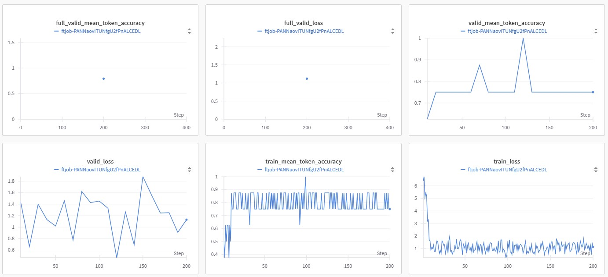

Better view of progress from wandb. What to look for:

- First few batch steps should show dramatic drop in train loss where model is leanring the structure and obvious stuff about the construct, like it is in dollars, prices and usually close to whole dollars, etc.
- What you are really looking for is continual progress from that point
- Good to see some variation, some batch steps with greater and lower loss, because your tryign to optimize and explore different possibilities
- Look for trend over time a gradual decrease in loss
- What could be a concern is if loss doesn't seem to be goign down
- Will pause at end of training to perform validation then send you an email whn the run completes

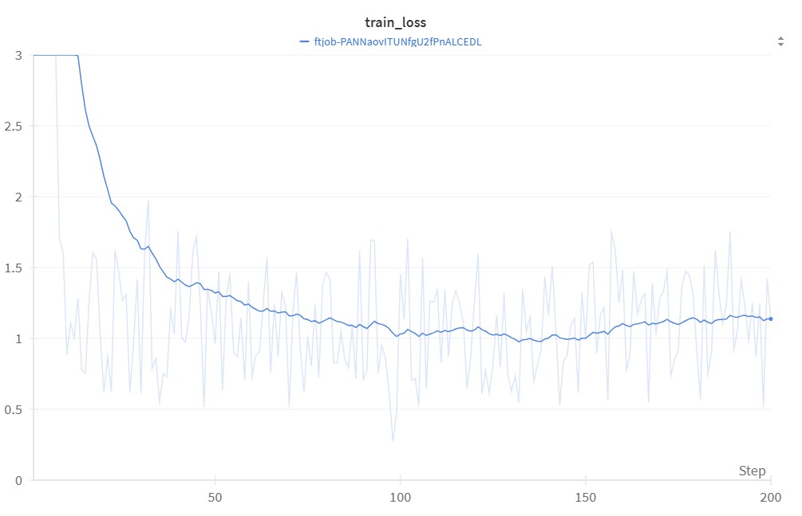

Results:

- Good loss for most of the run
- Tappers off after 140 and gets a little worseafter 150(?!)

#### Step 3: Test our fine tuned model

1. Get model name from job ID (or email from job complete notification):

```
fine_tuned_model_name = openai.fine_tuning.jobs.retrieve(job_id).fine_tuned_model
fine_tuned_model_name
```

> 'ft:gpt-4o-mini-2024-07-18:personal:pricer:BR9OWYkF'

2. Update function to create prompt without price:

```
def messages_for(item):
    system_message = "You estimate prices of items. Reply only with the price, no explanation"
    user_prompt = item.test_prompt().replace(" to the nearest dollar","").replace("\n\nPrice is $","")
    return [
        {"role": "system", "content": system_message},
        {"role": "user", "content": user_prompt},
        {"role": "assistant", "content": "Price is $"}
    ]

messages_for(test[0])
```

> [{'role': 'system',<br>
>   'content': 'You estimate prices of items. Reply only with the price, no explanation'},<br>
> {'role': 'user',<br>
>  'content': "How much does this cost?\n\nOEM AC Compressor w/A/C Repair Kit For Ford F150 F-150 V8 & Lincoln Mark LT 2007 2008 - BuyAutoParts NEW\nAs one of the world's largest automotive parts suppliers, our parts are trusted every day by mechanics and vehicle owners worldwide. This A/C Compressor and Components Kit is manufactured and tested to the strictest OE standards for unparalleled performance. Built for trouble-free ownership and 100% visually inspected and quality tested, this A/C Compressor and Components Kit is backed by our 100% satisfaction guarantee. Guaranteed Exact Fit for easy installation 100% BRAND NEW, premium ISO/TS 16949 quality - tested to meet or exceed OEM specifications Engineered for superior durability, backed by industry-leading unlimited-mileage warranty Included in this K"},<br>
> {'role': 'assistant', 'content': 'Price is $'}]

3. Create a utility function to extract the price from a string

```
def get_price(s):
    s = s.replace('$','').replace(',','')
    match = re.search(r"[-+]?\d\*\.\d+|\d+", s)
    return float(match.group()) if match else 0
```

4. Create he function for our fine tuned gpt-4o-mini model:

```
def gpt_fine_tuned(item):
    response = openai.chat.completions.create(
        model=fine_tuned_model_name,
        messages=messages_for(item),
        seed=42,
        max_tokens=7
    )
    reply = response.choices[0].message.content
    return get_price(reply)

print(test[0].price)
```

> 374.41<br>
> print(gpt_fine_tuned(test[0]))<br>
> 174.77

5. Test the model against all the test data:

`Tester.test(gpt_fine_tuned, test)`

#### Fine-tune model results: bad news!

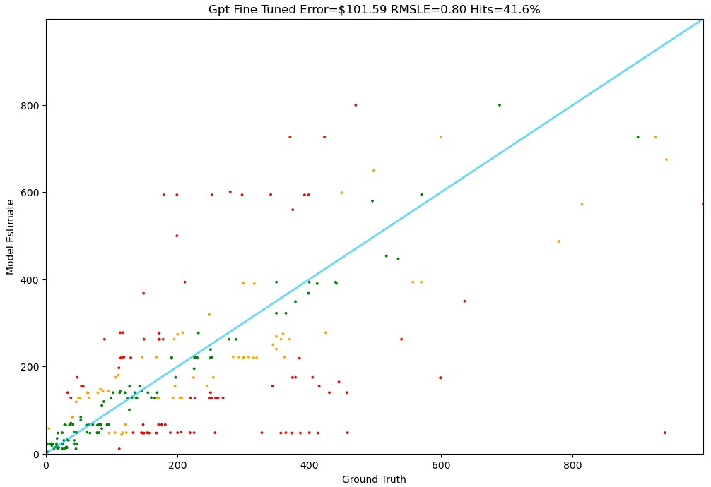

**Result**: Does worse than untrained Frontier models but better than most traditional ML methods and improved in reducing large outliers.

- GPT Fine Tuned Pricer Error=$101.59
- RMSLE=0.80
- Hits=41.6%

Compared to basline models

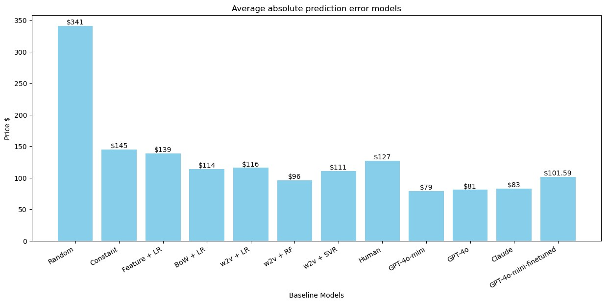

Key objectives of fine-tuning for Fronier models

1. Setting style or tone in a way that can't be acheived with prompting
2. Improving the reliability of producing a type of output
3. Correcting failures to follow complex prompts
4. Handling edge cases
5. Performing a new skill or task that's hard to articulate in a prompt

A problem like ours doesn't benefit significantly from Fine Tuning

- The problem and style of output can be clearly specified in a prompt
- The model can take advantage of its enourmous world knowldge from its pre-training; providing a few hundred prices doesn't help

### Fine-Tuning Open-Source Models

Compared to basline and Frontier models

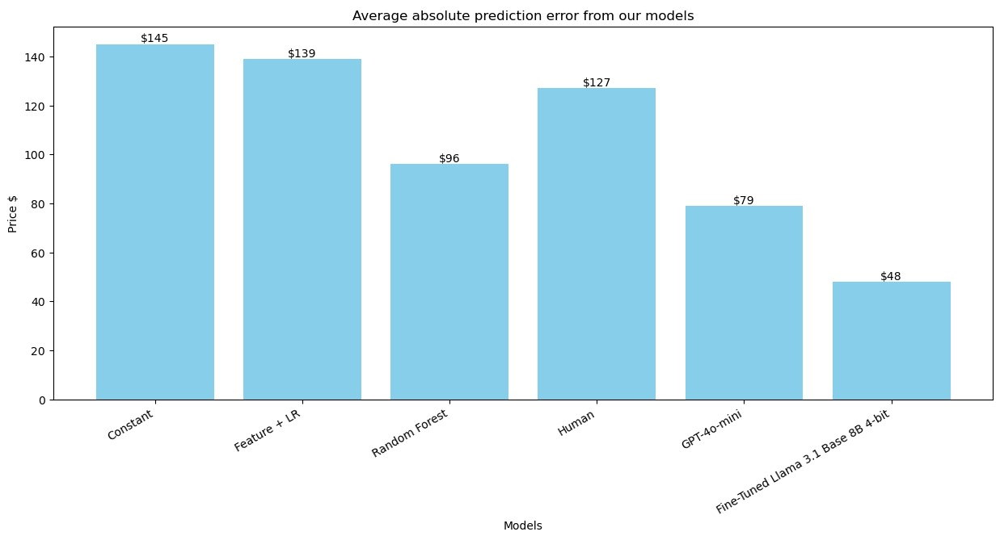

#### LoRA

[Low-Rank Adaptation (LoRA)](https://en.wikipedia.org/wiki/LoRa)

Papers:
[LoRA: Low-Rank Adaptation of Large Language Models](https://arxiv.org/abs/2106.09685)
[Attention Is All You Need](https://arxiv.org/pdf/1706.03762)

Using [Llama 3.1](https://ollama.com/library/llama3.1) with 8B weights - for too much for us to train on a GPU:

- Llama 3.1 8B architecture consists of 32 groups of modules stacked on top of each other, called 'Llama Decoder Layers'
- Each has [self-attention layers](<https://en.wikipedia.org/wiki/Attention_(machine_learning)>), [multi-layer perceptron (MLP)](https://en.wikipedia.org/wiki/Multilayer_perceptron) layers, [SiLU](https://pytorch.org/docs/stable/generated/torch.nn.SiLU.html) [activation](https://en.wikipedia.org/wiki/Activation_function) and [layer norm](<https://en.wikipedia.org/wiki/Normalization_(machine_learning)#Layer_normalization>)
- These parameters take up 32GB memory

##### High-level explanation of LoRA

**The idea of optimization**: Normally during optimization you do a forward parse through your neural network. You figure out the next token your netwrok predicted then compare it with what the token should have been. Based on what the actual, true token should have been you figure out how much you want to shift each of the different weights a little bit in order to make it better at predicting the token next time.

###### Step 1: Freeze the weights - we will not optimize them

First of all you freeze all these weights, initially you don't optimize these 8 billion weights (in the case of Llama 3.1 8b) because it is too many knobs to turn, too many gradients.


###### Step 2: Select some layers to target, called "Target Modules"

Instead, we pick a few of the layers that we think are the key things that we'd want to train. These layers, these modules, in this stacked layered architecture are known as the _Target Models_. The target modules are the layers of the neural netwrok that you will be focusing on for the purposes of training.

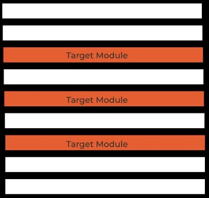

###### Step 3: Create new "Adaptor" matrices with lower dimensions, fewer parameters

The weights are frozen and instead you create new matrices called _Adaptor Matrices_ with fewer dimensions. So not as many dimensions as are in the real model, fewer dimensionality aka _Lower Rank_, that will be off to one side.

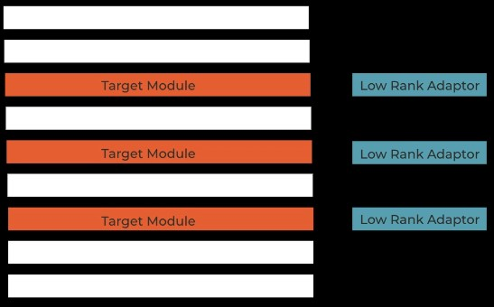

###### Step 4: Apply these adaptors to the Target Modules to adjust them - these get trained

You will have the technique for applying these matrices into the target modules so that they will adapt the target modules. There will be a formular that means in the future whatever values are in the _Low Rant Adaptors_ will slightly shift, will slightly change what goes on in the target modules, they adapt them. So it's lower weights, fewer dimentions, that will be applied against these target modules.

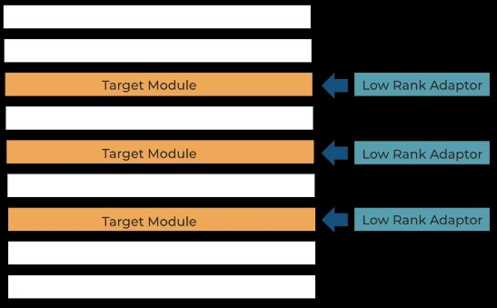

To be more precise: there are in fact 2 LoRA matrices that get applied.

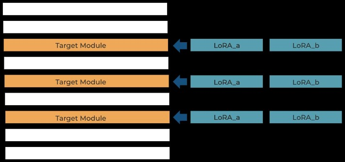

##### Quantization

The Q in QLoRA stands for [Quantization](https://en.wikipedia.org/wiki/Quantization). This is a great trick that allows you to fit bigger models in memory with the same number of parameters just lower precision.

You lose some fine grained control over the weights so can't adjust as precisely (e.g. instead of an volune knob you can turn slowly up to eleven you click up from 1.45 to 1.9 to 2.35 to 2.8 etc.). You get some reduction in quality of the neural network but not as much as you might think, it still retains a lot of its power.

Even the 8B variants of open-source models are enormous:

- 8 Billion \* 32 bits = 32GB
- Intuition: keep the number of weights but reduce their precision
- Model performance is worse, but the impact is surprisingly small
- Reduce to 8 bits, or even to 4 bits
  - Technical note 1: 4 bits are interpreted as float, not int
  - Technical note 2: the adaptor matrices are still 32 bit

##### Hyperparameters

A hyperparameter is one of these lever s that you, as the experimenter, get to choose what you want to it to be. There is no hard and fast rule about what it should be and you're meant to use a procies known as hyperparameter optimization to try different values and see what works best for your task at hand.

In reality this is just trial and error, a bit of guess work and experimentation becuase there arn't necessarily any theorectical reasons why it should be set one way, its just a case of practical experiments.

3 essential hyperparameters for LoRA fine-tuning:

1. r

   - The rank, or how many dimensions, in the low-rank matrices
   - **Rule of thumb**: Start with 8, then double to 16, then 32, until diminishing returns

2. Alpha

   - A scaling factor that multiplies the lower rank matrices
   - Alpha x LoRA_a matrice x LoRA_b matrice
   - **Rule of thumb**: Twice the value of r

3. Target Modules

   - Which of the layers of the neural network are adapted
   - **Rule of thumb**: Target the attention head layers

See [QLoRA: Hyperparameter Analysis lab - colab notes](https://github.com/jstoops/product-pricing-agent/blob/main/training/os-qlora.ipynb) for details.

#### Model Selection

Decisions to select our base model:

- **Number of parameters**: more gives you a better shot, particulaly where we have a lot of training data like we do in this case (400K) so the constraint is the amount of memory that we have the budget for (on a 4T can fit a 8B model but not much more)
- **Llama vs Qwen vs Phi vas Gemma**
- **Base or Instruct variants**: generally, if you are fine-tuning specifically for one problem where you have a particular prompt that you'll be using and expecting a response in a particular way then you might as well start with a base model, not an instruct variant, becuase you don't need to apply things like system prompts and user prompts. If you need to tee it up with a system promopt or final product needs a chat interface then an instruct variant is likely better as already trained to work with convesations

See [Base Model Evaluation - colab notes](https://github.com/jstoops/product-pricing-agent/blob/main/training/os-base-model-evaluation.ipynb) for details.

##### Leaderboards

Using Open LLM Leaderboard:

- filter: 1 to 9 billion parameters, just the base models (continuously pretrained & pretrained)
- show: # Params

Toggle on the chat (aka instruct) varants: these are trained using varous reinforcement techniques to respond to that particular chat instruct style. When it is given that framework it is more likley to be able to perform against these varous tests because it will respond to the instruction it is being given rather than being expected to be trained to adapt to a given task. Therefore, you are getting a more realistic view of the capabilities, even of the base model, if you look at how it performs with benchmarks when you look at the instruct variation. This indicates that the base model is good at adapting to be able to address these different benchmarks if the chat variant scores better.

##### Tokenization Strategy

Llama 3.1 is being picked because, although it doesn't score as well as other models, there is a convienance to Llama that makes the code a bit simpler and the task a bit easier: when you look at the tokenizer for Llama you see that every number from 0 to 999 gets mapped to one token.

The same is not true for Qwen, Phi-3 or Gemma - all 3 models have a token per digit. For example, if the next token it predicts is 9 then that could be \\$9, \\$99 or \\$999 and that will only transpire when it does the token after that.

This results in, when training for a task like this, we're using a model to generate tokens and make it think more like a regression model. We want it to solve and get better and better at predicting the next token and that should map to the price so it simplifies the problem if the price is reflected in exactly 1 token that the model has to generate.

The tokenization strategy for Llama 3.1 works very well becuase the single next token that it generates will in itself reflect everything about the price. The single token that it projects as the next token in it's answer will reflect the full price of the product in one token.

It is a nuance but is a reason why we lean towards selecting Llama 3.1 in this case. We should test out the other models to see how they perform and verify this hypothesis.

This gives Llama a bit of an edge because of this convience in the way that it tokenizes.

#### Major Hyperparameters for Fine-Tuning

5 important hyper-parameters for QLoRA:

1. **Target Modules**: Pick a few layers in the architecture, the "Target Modules", freeze the weights, and train a lower dimensional matrice to apply to the Target Modules and use as a delta on the orignal layers
2. **r**: how many dimensions in the lower dimensional adaptor matrice
3. **Alpha**: is the scaling factor used to multiply up the importance of this adaptor when it is applied to the target module
4. **Quantization**: reduce the precision of the weights in the base model
5. **Dropout**: a technique know as [dropout regularization](https://wandb.ai/authors/ayusht/reports/PyTorch-Dropout-for-regularization-tutorial---VmlldzoxNTgwOTE), which means it is a technique used to prevent the model from doing what is know as [overfitting](https://en.wikipedia.org/wiki/Overfitting).

#### Dropout

Usually use 5-20% for the dropout hyperparameter.

Overfitting is when a model gets so much training data and goes through so much traiing that it starts to just expeect exactly the structure of the data in the training data set and give back exactly that answer.

It starts to no longer understand the general trends of what is being suggested but instead hones in on precisely those words and predictions whne it comes later. As a result of that when you give it some new ponit that it hasn't seen in its training data set it performs really badly becuase it has not been learning the general themes.

This general theme, flavor or nuance is what you are trying to teach the model.

What dropout does is simply remove a random subset of the neurons from the deep neural network, from the transformer. It takes a random percentage (say 10%) and wipes them out, its as though they're just not there and as a result everytime you're gong through training the model is seeing a different subset (a different 90%) of the neural network and so the weights are discouraged from being too precise and looking to precisely for a certain set of input tokens.

Instead, becuase different nerons participate every time in the training process it starts to leanr more the general theme than leanring very specifically how to expect different tokens.

It prevents any one neron from becoming too specialized, it supports the concpet of a more generalized understanding in the neural network in this very simplist way of removing a percentage of nerons form the process each time (different newrons each time).

Usually use 5-20% droput percentage.

### QLoRA Training of Open-Source Models

The four steps in training:

1. **Forward pass**: predict the next token in the training data, aka running inference
2. **Loss calculation**: how different was it to the true next token, aka cross-entropy loss
3. **Backward pass**: how much should we tweak parameters to do better next time (the "gradients"), aka back propagation, backprop
4. **Optimization**: update parameters a tiny step to do better next time

Note: this is for QLoRA based training. Ordinary training and fine-tuning, not LoRA base, then it would be the whole model that would need to be having gradients calculated and need to be shifted during optimization. That's what the big companies do to train the models in the first place and spent a significant amount of money to do so.

See [Open-Source Model Training - colab notes](https://github.com/jstoops/product-pricing-agent/blob/main/training/os-model-training.ipynb) for details.

Step 1: Forward pass

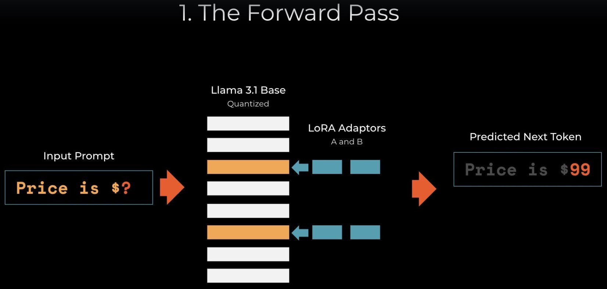

Step 2: Loss calculation

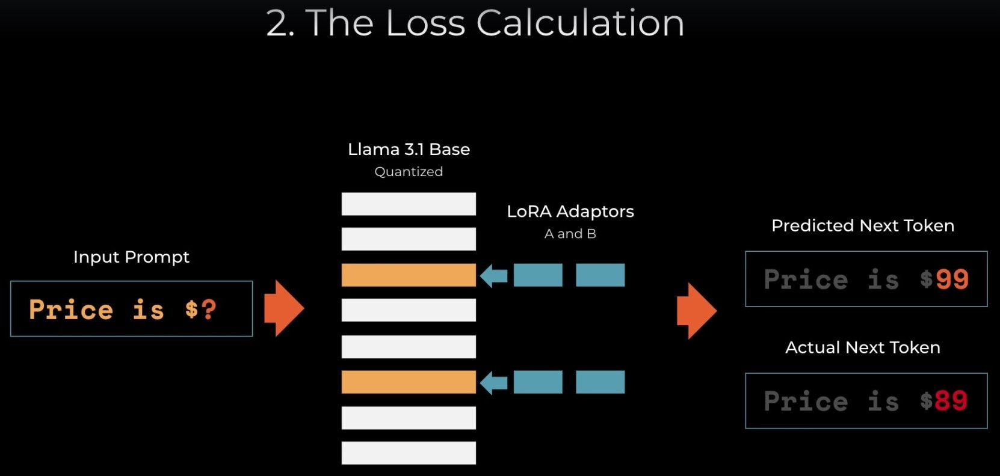

Step 3: Backward pass

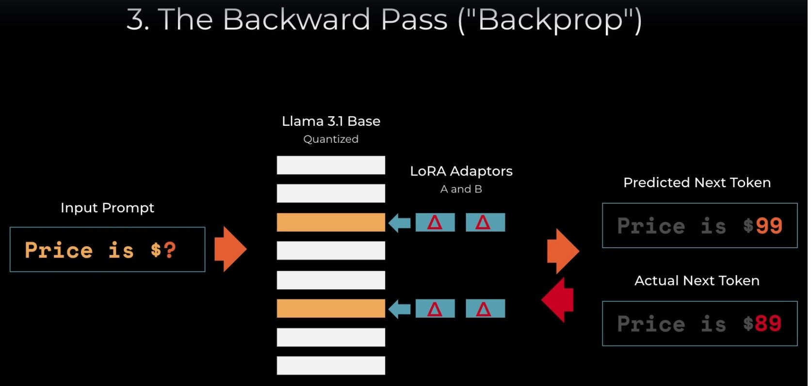

#### Next Token Prediction and Cross Entropy Loss

The whole process of Generative AI is a classic [classification](https://en.wikipedia.org/wiki/Statistical_classification) problem.

The model output:

- The model doesnh't simply "Predict the next token"
- Rather, it outputs the probabilities of all possible next tokens
  - This is the result of using the 'softmax' functions over the output from the last layer (llm_head)
- During inference, you can pick the token with highest probability, or sample from possible next tokens

The loss function:

- The approach for calculating loss is quite simple:
  - Just ask: what probability did the model assign to the token that actually was the correct next token?
  - In practice we then take the log of this porbability and times it by -1
  - So 0 means we were 100% confident of the right result; hiher numbers mean lower confidence
- This is called cross-entropy loss

#### Major Hyperparameters for Training

5 important hyper-parameters for training:

1. **Epochs**
2. **Batch Size**
3. **Learning Rates**
4. **Gradient Accumulation**
5. **Optimizer**

##### Epochs & Batch Sizes

The _Epoch_ is how many times are you going to go through your entire dataset as part of the training process.

Every time you go through the training dataset you have an opportunity to move the weigths a little closer to making it better. Every time the model is trained it is in a slightly different state which is why sometimes using thew same dataset can work to refine it.

Often we don't just take one data point and put it through, forward pass the model, to predict the next token, calculate the loss, then go backwards to figure out the gradients to see how much does that loss wagets affected by the different weights/parameters in the model then optimize the model by doing a little step in the right direction.

It sometimes makes sense to do that at the same time with a bunch of different data points like 4 or 8 or 16 and do it together for all 16. Reasons for doing that: performance, get through everything faster like if you can fit 16 adata points on your GPU then good to do.

Typically it is important in each epoch to sort, juggle up all of the batches so they are different sets of these 16 data points that the model sees in each of these epochs so in some ways the data is different for each of these epochs becuase it is seeing a different sample of your data points as it goes through them.

At the end of each epoch you typically save your model. Run a bunch of epochs and then test how our model performance at the end of each of those epochs. What you often find is that the model is getting better and better as it leanrs more and more in each epoch. But then you reach a point where the model starts to overfit, it gets so used to seeing this training data that it solves just for that training data. Then when you test it the performance gets worse because it it not expecting points outside its traning dataset.

What you do is quite simply pick the epoch which gave you the best model, the best outcome and that's the one that you consider the result of your training, the version of the fine-tuned model that you take forward.

##### The Learning Rate

The purpose of training is that you take a training data point you do what you call a forward pass, which is inference where you go through th model and say predict the next token that should come and it gives a prediction, a probability of all of the next tokens.

You use that and have the actual token that it should have actually been and you can take these 2, the prediction and the actual, to come up with a loss - how poorly did it do at predicting thes actual.

You can then take that loss and do back propagation when you go back through the model and figure out how sensitive, how much would I have to tweak each weight up or down, in order to do a little bit better next time.

You then have to take a step in the right direction, you have to shift your weights, to do better next time. That step where you shift your weights in the next direction to do better next time is called the _Learning Rate_.

Typically its either 0.0001 or 0.00001.

There is also what is known as a _Learning Rate Scheduler_ when you start the learening rate at one number and during the course of your run, over the period of several epochs, you gradually lower and lower it becuase as your model gets more trained you want your learning rate, the amount of step you take, to get shorter and shorter until you are only making tiny adjustments to your neural netwrok becuase you're pretty confident that you are in the right vicinity.

Important to experiment with this one, no right answer. Tradeoff between going to fast and missing best result (skipping over valley) and going too slow taking too long to get to that dip in the valley of the best loss, or if more than one valley may not realize there is a deeper valley if going too slow aka _being stuck in the local minimun_.

##### Gradient Accumulation

A technique that allows you to improve speed of going through training where you say ok we normally we do a forward pass and get the loss then work out the gradients, going backwards, then we take a step in the right direction. The we repeat.

_Gradient Accumulation_ says well perhaps what we can do is a forward pass to get the gradients and don't take a step just take a second forward pass and get the gradients, add up those gradients and do that a few more times. Just keep accumalating these gradients and then take a step and optimize the neural network.

This means you do these steps less frequently which means they run a bit faster.

##### Optimizer

The _Optimizer_ is the formular that is used when it is time, when you've got the gradients and the learning rate, to make an update to your neural network to shift everything a little bit in a good direction so that next time it's a little bit more likely to predict the right next token.

The process for doing that, or the algorithm that you pick, is called the Optimizer and there are a bunch of well known formulae foi how you could do that each with pros and cons.

### Evaluate Fine-Tuned Open Source Model

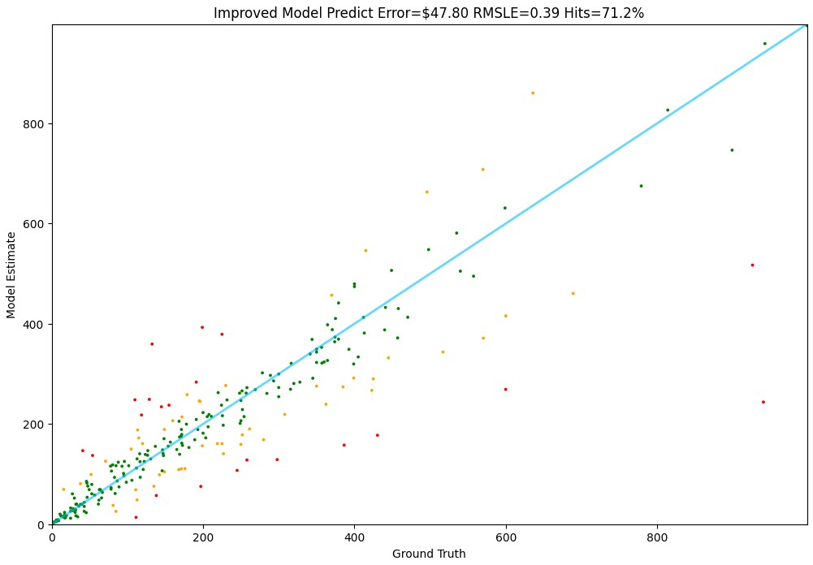

**Result**: Massive improvement and beats all the Frontier models!

- Llama 3.1 8B Fine-Tuned 4 Bit Pricer Error=$47.80
- RMSLE=0.39
- Hits=71.2%


### Agents

- Ensemble Agent: estimates prices
  - Frontier Agent: RAG pricer
  - Specialist Agent: estimates prices
  - Random Forest Agent: estimates prices
- Scanner Agent: identifiers promising deals
- Messaging agent: sends push notifications
- Planning Agent: coordinates activities


Custom Agentic AI Framework

#### Frontier RAG Pricer

Load 400,000+ price data into a vectorstore and provide Frontier Model 5 similar products with actual prices as connext to predict the price.

Note: the number of similar products provided is a hyper-parameter that can be changed to what gives the best results. The more provided as context means more input tokens so costs will go up proportionally for each call (less than 160 tokens per product since we truncated the combined details after this in the dataset).

##### GPT 4o Mini RAG

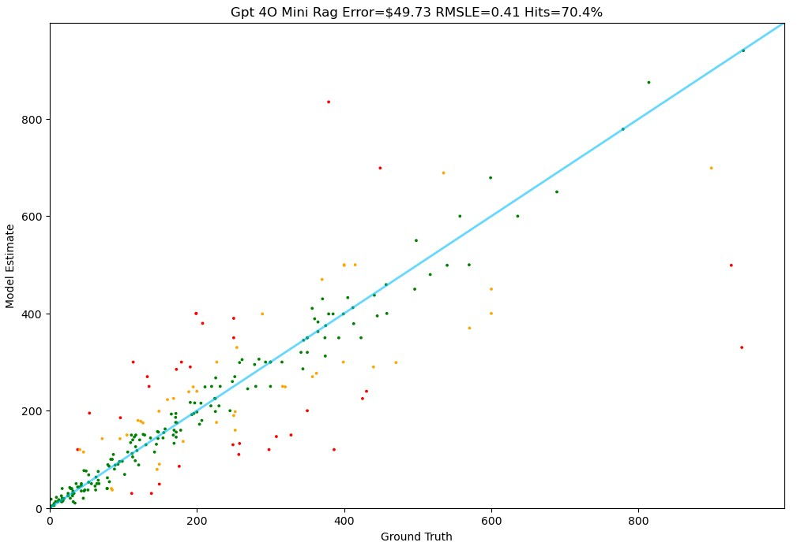

**Result**: Significantly better results compared to all the Frontier models without RAG but not as good as fine-tuned open-source model.

- GPT 4o Mini RAG Pricer Error=$49.73
- RMSLE=0.41
- Hits=70.4%

##### DeepSeek Chat RAG

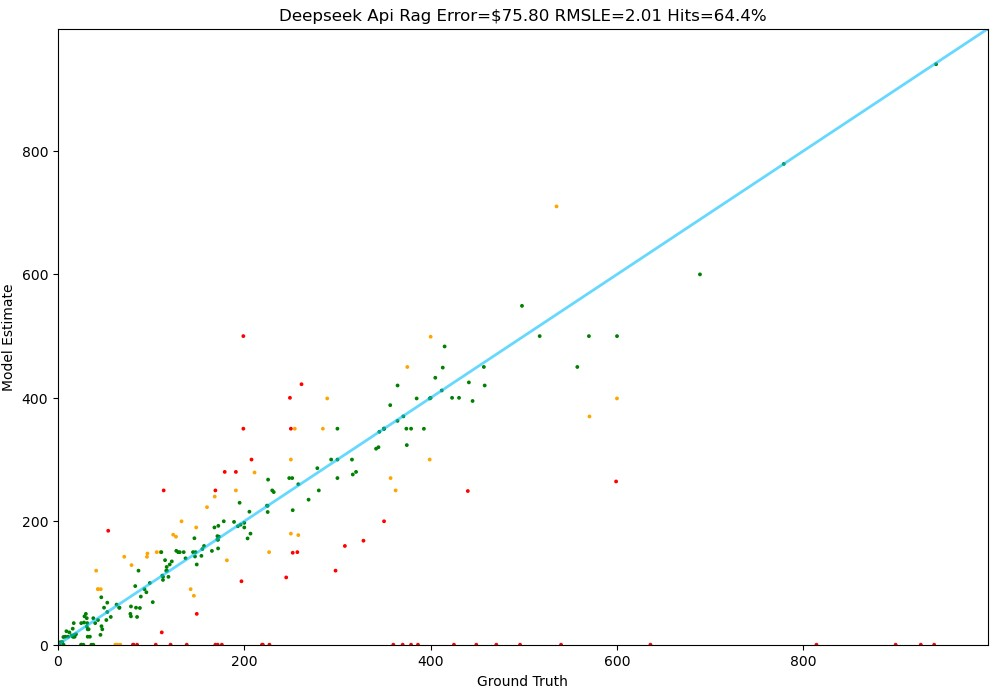

**Result**: Slightly better than the Frontier models without RAG but not as good as fine-tuned open-source model.

- DeepSeek Chat RAG Pricer Error=$75.80
- RMSLE=2.01
- Hits=64.4%

#### Random Forest Model

Trained using the vectors 400k products in Chroma, from the SentenceTransformer model.

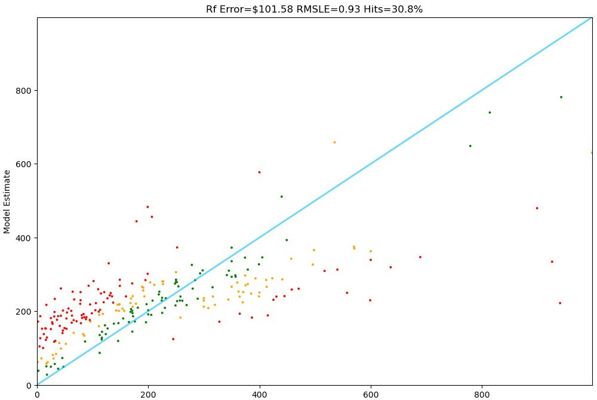

**Result**: Did worse than Random Forest using a smaller sample set but still better than the other traditional ML techniques.

- Random Forest Pricer Error=$101.58
- RMSLE=0.93
- Hits=30.8%

#### Ensemble Model

This model looks a the predicted prices of the specialist model (fine-tuned), frontier RAG pricer (GPT 4o Mini) and random forests model for the test dataset.

In a panda dataframe put these 3 model predictitions along with the minimum and maximum for X and in a panda series the actual prices for Y. Then train a simple Linear Regression model to find _what rated average difference between these series gives you the best fit, the best result, for this data_.

**Coefficients:**

First attmept:
- Specialist: 0.35
- Frontier RAG: 0.08
- Random Forest: -0.59
- Min: 0.58
- Max: 0.52

Intercept=35.78

**Result**: Disappointedly this is slightly worse than fine-tuned open-source model for this dataset.

- Ensemble 1 Pricer Error=$54.43
- RMSLE=0.55
- Hits=65.6%

Second attempt
- Specialist: 0.64
- Frontier RAG: 0.27
- Random Forest: -0.14
- Min: 0.10
- Max: 0.09

Intercept=25.23

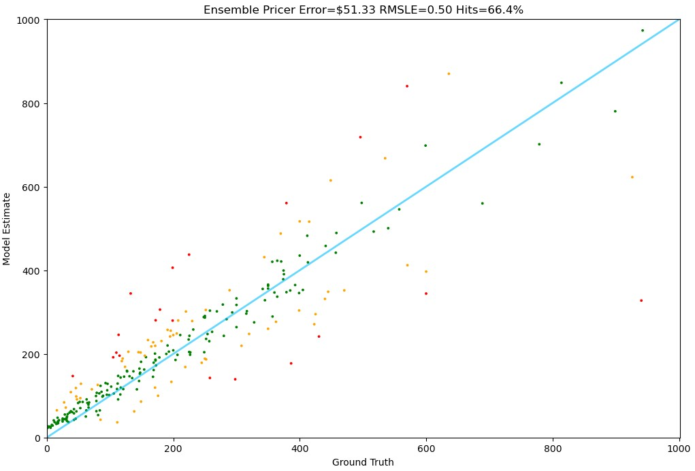

**Result**: A little improvement but still slightly worse than fine-tuned open-source model for this dataset.

- Ensemble 2 Pricer Error=$51.33
- RMSLE=0.50
- Hits=66.64%

Note: for a better assessment on how it weighs the 3 models remove the min and max since the Random Forest is baked into those.

This model works by using the 3 Agents (Specialist, Frontier and Random Forest) to:

1. Predict a price based on a description provided
2. Builds a dataframe for X, including the min and the max
3. Predict the price by passing in X to the Ensemble Model for Y
4. Return Y for the predicted price using the Linear Regression model

Note: more work to be done if turning this into a commercial product. Maybe the intercept number was too high? Above is another attempt using a new Random Forest model that provides a lower intercept and different cooefficients.

#### Deals Scrapper

The Deals Module looks for promising deals by subscribing to RSS feeds.

Using a python module that:

- Defines a series of RSS feeds that return deals for categories that closely match products our models have been trained for
- The `extract` function cleans-up HTML and extracts usful text
- The `ScrapedDeal` class represents a deal retreived from an RSS feed
  - Populate a deal based on the title, summary, and URL then scrapes the content using the BeautifulSoup parser, scrubs it and optionally build some features, if provided
  - The `fetch` class method iterates through all the feeds and calls `feedparser.parse` python package to pull the RSS feeds and return them as a dictionary then get the top 10 deals from each feed to create an instance of each deal to return with a sleep of 0.5 as good scraping practices to not hammer the site for data
- 3 other classes are defined to ensure GPT 4o returns structures output that are subclasses of the pydantic BaseModel that makes it easy to switch between a JSON version of a class and the class itself
  - `Deal` class: represents a deal with a summary description, price and URL
  - `DealSelection` class: represents a list of deals that we ask GPT 40 to respond with (see example JSON below)
  - `Opportunity` class: represents a possible opportunity, i.e. a deal where we estimate it should cost more than it's being offered for (discount is just the difference between the deal's price and the estimate).

Example JSON we want GPT 4o to respond with:

    {
        "deals" : [
            {
                "product_description": "A description of product 1",
                "price": 1.99,
                "url": "https://domain.com/product/1"
            },
            {
                "product_description": "A description of product 2",
                "price": 2.99,
                "url": "https://domain.com/product/2"
            }
        ]
    }

Note: not all deals return a price. Some return a discount and others may combine multiple products in the offer, e.g. 20% off all Apple watches. This data is extremely hard to handle with traditional coding to to provide a robust way to extract the price of the deal in any reliable way. _Hence using a frontier model to do that for us_. Although I have noticed that GPT has goofed and thought a deal for $350 off mans for a price of $350 so may need to refine the prompt.

- Added to system and user prompt: _Be careful with products that are described as "$XXX off" or "reduced by $XXX" - this isn't the actual price of the product. Only respond with products when you are highly confident about the price._

GPT 4o will take the deals we provide (5 x 10 feeds = 50 deals) and we will ask it to find the best 5 deals that are most clearly explained from this big set, pluck them out, and summarize it back to us. AND we want that in _structured output_: I will tell you what format I want that and you will respond with exactly that format.

Code:

    def get_recommendations():
        completion = openai.beta.chat.completions.parse(
            model="gpt-4o-mini",
            messages=[
                {"role": "system", "content": system_prompt},
                {"role": "user", "content": user_prompt}
        ],
            response_format=DealSelection
        )
        result = completion.choices[0].message.parsed
        return result

#### Scanner Agent

The Scanner Agent using the Deals Scraper to `fetch_deals` by calling `ScrapeDeal.fetch()` and passes in deals from a previous search to make sure only new deals are returned. The `scan` method that uses `make_user_prompt` to0 create a prompt that calls GPT 4o with the response format set to the `DealSelection` class to make sure the result is retuned in the correct format. Returns any deals that are greater than zero dollars, or None if there aren't any.

#### Messaging Agent

Used to send txt messages and push notifications when a great deal is found. For push notifications [Pushover](https://pushover.net/) is used, which is free for up to 10K messages. For sending text messages [Twilo](https://www.twilio.com/) is used, which is $0.0079 per SMS or $0.02 for MMS.

Configuration:

- `DO_TEXT`: send txt messages
- `DO_PUSH`: send push notifications

#### Planning Agent

Used to coordinate activities.

Configuration:

- `DEAL_THRESHOLD`: set to dollar amount of difference between product price and deal to trigger sending a notification

Using simple python code that:

- Creates instances of the 3 Agents: scanner, ensemble, and messenger
- The `run` method takes a deal and turns it into an opportunity

#### Agent Framework

This will handle the database connectivity to chroma RAG db, persistent memory, logging, and ability for UI to integrate with it.

**agent.py**
The `Agent` superclass, that all the other agents inherit from, provides a `log` method that includes the name of the agent and a unique log message color for each agent.

**memory.json**
The `memory.json` file contains a list of JSON blobs representing the opportunity objects that inlcudes a deal, estimate, and discount.

**deal_agent_framework.py**

The Agent Framework `init_logging` function sets up logging that ensure when INFO level logs are created they are written out to `stdout` with a specific structure.

The `DealAgentFramework` class has the database name and memory filename properties and when it starts up it:

- Starts logging by calling `init_logging()`
- Creates log messages
- Loads the enviornment variables
- Accesses the database
- Reads the `memory.json` file into memory
- Initializes the Planning Agent with the product collection from the database

Methods:

- The `read_memory` method loads in the opportunities from the `memory.json` file
- The ``write_memory` method saves opportunities to the `memory.json` file
- The `log` method writes messages to the log with the framework's name
- The `run` method kicks off the Planning Agent and when it gets a new result it adds it to memory

The following lines ensure that if it is being run from the commandline then it creates a new instance of the `DealAgentFramework` class and call the `run` method.

```
if __name__=="__main__":
    DealAgentFramework().run()
```

**Push Notification**


#### UI

Features:
- Agent framework runs in the background and loads new deals when found
- Clicking on the deal sends a push notification

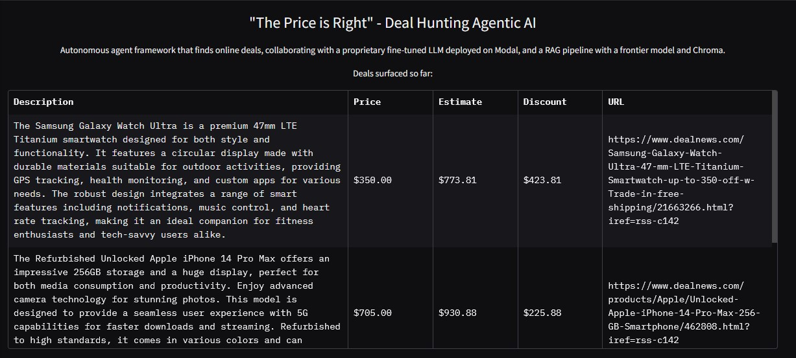

## Productionize

### Deploy Specialist Agent to Estimate Prices using Fine-Tuned Model

Source code and models:

- [Fine-tuned pricer model](https://huggingface.co/clanredhead/pricer-2025-04-30_01.18.39)
- [Pricer Service](https://github.com/jstoops/product-pricing-agent/services/pricer_service.py)
- [Specialist Agent](https://github.com/jstoops/product-pricing-agent/agents/specialist_agent.py)

Deployment steps:

1. Push our fine-tuned model to Hugging Face:

`fine_tuning.model.push_to_hub(PROJECT_RUN_NAME, private=True)`

2. Deploy a service to modal for calling fine-tuned model:

`modal deploy -m pricer_service`

3. Deploy specialist agent:

LLMOps:

- Log message color: <span style="color:red">RED</span>
- [pricer-server on Modal](https://modal.com/apps/jstoops/main/deployed/pricer-service)

Usage:

```
from agents.specialist_agent import SpecialistAgent

agent = SpecialistAgent()
agent.price("iPad Pro 2nd generation")
```

### Deploy Froniter Agent for RAG Pricer

Source code and data:

- [Product Vector Databasel](https://huggingface.co/clanredhead/pricer-2025-04-30_01.18.39/blob/main/models/products_vectorstore)
- [Frontier Agent](https://github.com/jstoops/product-pricing-agent/agents/frontier_agent.py)

DataOps:

- Log message color: <span style="color:blue">BLUE</span>

**2D Visualization of Pricer Vectorstore**

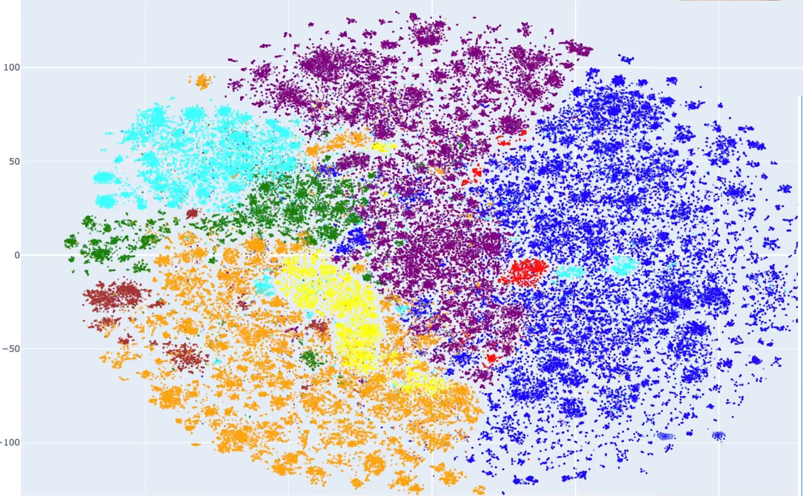
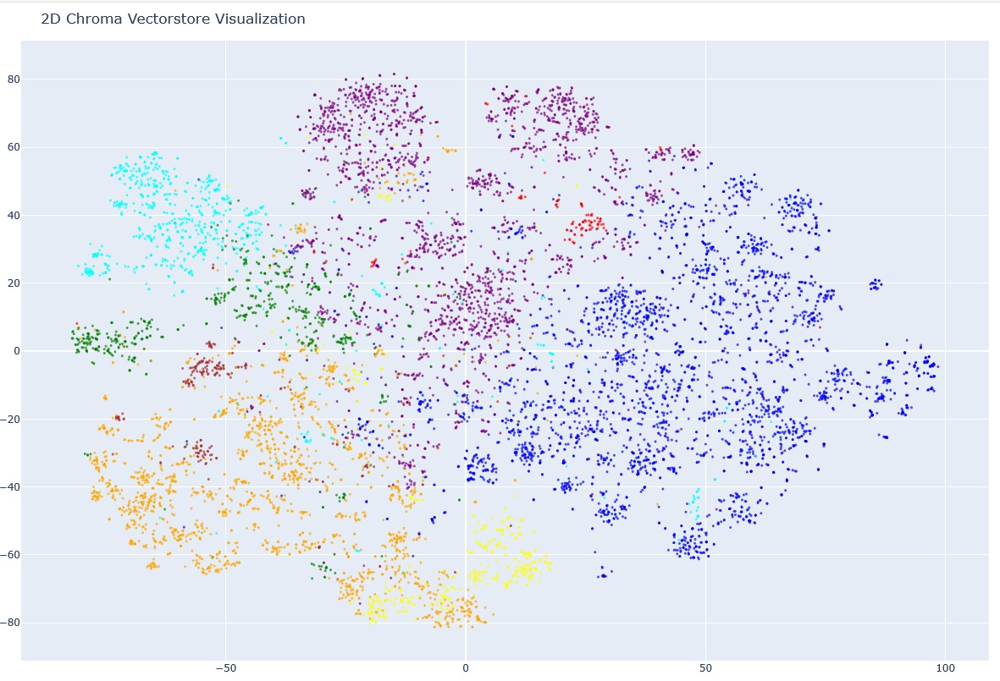

Usage:

```
import chromadb
from agents.frontier_agent import FrontierAgent

DB = "products_vectorstore"
client = chromadb.PersistentClient(path=DB)
collection = client.get_or_create_collection('products')

agent = FrontierAgent(collection)
agent.price("iPad Pro 2nd generation")
```

### Deploy Random Forest Agent

Source code and data:

- [Random Forest Model](https://huggingface.co/clanredhead/pricer-2025-04-30_01.18.39/blob/main/models/random_forest_model.pkl)
- [Random Forest Agent](https://github.com/jstoops/product-pricing-agent/agents/random_forest_agent.py)

MLOps:

- Log message color: <span style="color:magenta">MAGENTA</span>

Usage:

```
from agents.random_forest_agent import RandomForestAgent

rf_model = joblib.load('random_forest_model.pkl')
random_forest = RandomForestAgent()
random_forest.price("iPad Pro 2nd generation")
```

### Deploy Ensemble Agent

Source code and data:

- [Ensemble Model](https://huggingface.co/clanredhead/pricer-2025-04-30_01.18.39/blob/main/models/ensemble_model.pkl)
- [Product Vector Databasel](https://huggingface.co/clanredhead/pricer-2025-04-30_01.18.39/blob/main/models/products_vectorstore)
- [Ensemble Agent](https://github.com/jstoops/product-pricing-agent/agents/ensemble_agent.py)

DataOps:

- Log message color: <span style="color:yellow">YELLOW</span>

Usage:

```
import chromadb
from agents.ensemble_agent import EnsembleAgent

DB = "products_vectorstore"
client = chromadb.PersistentClient(path=DB)
collection = client.get_or_create_collection('products')

ensemble = EnsembleAgent(collection)
ensemble.price("iPad Pro 2nd generation")
```

### Deploy Deals Module

Source code and data:

- [Deals Module](https://github.com/jstoops/product-pricing-agent/agents/deals.py)

DataOps:

Feed URLs

- https://www.dealnews.com/c142/Electronics/?rss=1
- https://www.dealnews.com/c39/Computers/?rss=1
- https://www.dealnews.com/c238/Automotive/?rss=1
- https://www.dealnews.com/f1912/Smart-Home/?rss=1
- https://www.dealnews.com/c196/Home-Garden/?rss=1

Usage:

Get deals
```
from agents.deals import ScrapedDeal
scraped = ScrapedDeal.fetch()
result = [scrape for scrape in scraped if scrape.url not in urls]
```

Use structured output
```
from agents.deals import DealSelection
def get_recommendations():
    completion = openai.beta.chat.completions.parse(
        model="gpt-4o-mini",
        messages=[
            {"role": "system", "content": system_prompt},
            {"role": "user", "content": user_prompt}
      ],
        response_format=DealSelection
    )
    result = completion.choices[0].message.parsed
    return result
```

### Deploy Scanner Agent

Source code and data:

- [Scanner Agent](https://github.com/jstoops/product-pricing-agent/agents/scanner_agent.py)

DataOps:

- Log message color: <span style="color:cyan">CYAN</span>

Usage:

```
from agents.scanner_agent import ScannerAgent

agent = ScannerAgent()
result = agent.scan()
```

### Deploy Messaging Agent

Source code and data:

- [Messaging Agent](https://github.com/jstoops/product-pricing-agent/agents/messaging_agent.py)

DataOps:

- Log message color: <span style="color:white">WHITE</span>
- [Usage Monitoring for pricer_deal app](https://pushover.net/apps/wkvvq7-pricer_deal)

Usage:

```
from agents.messaging_agent import MessagingAgent

agent = MessagingAgent()
agent.push("You have a deal!")
```

### Deploy Planning Agent

Source code and data:

- [Planning Agent](https://github.com/jstoops/product-pricing-agent/agents/planning_agent.py)

DataOps:

- Log message color: <span style="color:green">GREEN</span>

Usage:

```
import chromadb
from agents.planning_agent import PlanningAgent

DB = "products_vectorstore"
client = chromadb.PersistentClient(path=DB)
collection = client.get_or_create_collection('products')
planner = PlanningAgent(collection)
planner.plan()
```


### Deploy Deal Agent Framework

Source code and data:

- [Deal Agent Framework](https://github.com/jstoops/product-pricing-agent/frameworks/deal_agent_framework.py)
- [Memory File](https://github.com/jstoops/product-pricing-agent/frameworks/memory.json)

DataOps:

- Example [logs from first run](https://github.com/jstoops/product-pricing-agent/logs/first-run.txt)

Usage:

Pre-requisites:

- `conda activate [env-name]`

Run from the commandline:
`python deal_agent_framwork.py`

### Deploy Gradio UI

Source code and data:

- [Product Pricer UI](https://github.com/jstoops/product-pricing-agent/ui/product_pricer.py)
- [Product Pricer Ops UI](https://github.com/jstoops/product-pricing-agent/ui/product_pricer_ops.py)

AppOps:

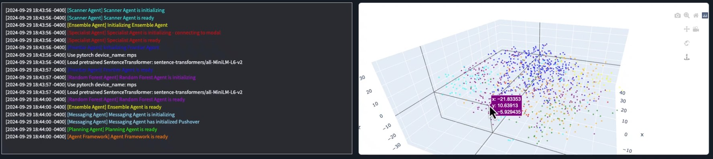

Usage:

Pre-requisites:

- `conda activate [env-name]`

Run from the commandline:
`python product_pricer.py`

Or with powerful GPU with a lot of memory:
`python product_pricer_ops.py`

# Troubleshooting

## Failed to call function locally when using Modal directive

Error when running `!modal setup` in JupyterLab:

+- Error ---------------------------------------------------------------------+
| 'charmap' codec can't encode character '\u280b' in position 0: character |
| maps to <undefined> |
+-----------------------------------------------------------------------------+

Then running the following failed:

    from hello import app, hello, hello_europe

    with app.run():
      reply=hello.local()
      reply

### Cause

Authorized tokens not saved to local profile or environment

### Solution

need to run this command from a command prompt in an activated environment afterwards:
modal token new

### Result

Web authentication finished successfully!
Token is connected to the jstoops workspace.
Verifying token against https://api.modal.com
Token verified successfully!
Token written to C:\Users\jd_st/.modal.toml in profile jstoops.

## Automounting Image Error

    from llama import app, generate

llm_engineering\week8\llama.py:14: DeprecationError: 2025-02-03: Modal will stop implicitly adding local Python modules to the Image ("automounting") in a future update. The following modules need to be explicitly added for future compatibility:

- hello

e.g.:
image_with_source = my_image.add_local_python_source("hello")

For more information, see https://modal.com/docs/guide/modal-1-0-migration
@app.function(image=image, secrets=secrets, gpu=GPU, timeout=1800)

### Cause

Using deprecated code

### Solution

REF: https://modal.com/docs/guide/modal-1-0-migration
TBD - adding `.add_local_python_source("generate")` did not work!

## Frontier Agent Always Uses DeepSeek

INFO:root:[Frontier Agent] Initializing Frontier Agent
INFO:root:[Frontier Agent] Frontier Agent is setting up with DeepSeek

### Cause

Set to use if key set

### Solution

Workaround: comment out this code in frontier_agent.py, restart kernal then create FrontierAgent:

    deepseek_api_key = os.getenv("DEEPSEEK_API_KEY")
    if deepseek_api_key:
        self.client = OpenAI(api_key=deepseek_api_key, base_url="https://api.deepseek.com")
        self.MODEL = "deepseek-chat"
        self.log("Frontier Agent is set up with DeepSeek")
    else:

Need to refactor code so uses config variable to set model to use.
